# 	计算机网络


## 输入网址后发生了什么

https://mp.weixin.qq.com/s/I6BLwbIpfGEJnxjDcPXc1A

1.浏览器做的第一步工作是解析 URL

对 `URL` 进行解析之后，浏览器确定了 Web 服务器和文件名，接下来就是根据这些信息来生成 HTTP 请求消息了。

2 真实地址查询 —— DNS 


3 协议栈

通过 DNS 获取到 IP 后，就可以把 HTTP 的传输工作交给操作系统中的**协议栈**。

04 可靠传输 —— TCP 

TCP 传输数据之前，要先三次握手建立连接

TCP 分割数据

TCP 报文生成

05  远程定位 —— IP 

TCP 模块在执行连接、收发、断开等各阶段操作时，都需要委托 IP 模块将数据封装成网络包发送给通信对象。

06 两点传输 —— MAC 

用于两点之间的传输

07 出口 —— 网卡 

08 送别者 —— 交换机 

交换机的设计是将网络包原样转发到目的地。交换机工作在 MAC 层，也称为二层网络设备。


## TCP粘包

https://juejin.im/post/5b67902f6fb9a04fc67c1a24#comment

TCP 是一个面向字节流的协议，它是性质是流式的，所以它并没有分段。就像水流一样，你没法知道什么时候开始，什么时候结束。


解决：

- 在报文末尾增加换行符表明一条完整的消息，这样在接收端可以根据这个换行符来判断消息是否完整。
- 将消息分为消息头、消息体。可以在消息头中声明消息的长度，根据这个长度来获取报文（比如 808 协议）。
- 规定好报文长度，不足的空位补齐，取的时候按照长度截取即可。

## UDP实现可靠

https://zhuanlan.zhihu.com/p/30770889


**CP属于是通过增大延迟和传输成本来保证质量的通信方式，UDP是通过牺牲质量来保证时延和成本的通信方式，所以在一些特定场景下RUDP更容易找到这样的平衡点。**RUDP是怎么去找这个平衡点的

可靠的概念

在实时通信过程中，不同的需求场景对可靠的需求是不一样的，我们在这里总体归纳为三类定义：

l **尽力可靠**：通信的接收方要求发送方的数据**尽量完整**到达，但业务本身的数据是可以允许缺失的。例如：音视频数据、幂等性状态数据。

l **无序可靠**：通信的接收方要求发送方的数据**必须完整到达，但可以不管到达先后顺序**。例如：文件传输、白板书写、图形实时绘制数据、日志型追加数据等。

l **有序可靠**：通信接收方要求发送方的数据必须**按顺序完整到达**。

RUDP是根据这三类需求和图1的三角制约关系来确定自己的通信模型和机制的，也就是找通信的平衡点。 

UDP为什么要可靠

TCP是个基于公平性的可靠通信协议，在一些苛刻的网络条件下TCP要么不能提供正常的通信质量保证，要么成本过高。为什么要在UDP之上做可靠保证，究其原因就是在保证通信的时延和质量的条件下尽量降低成本

实现：

重传模式 窗口与拥塞控制

## TCP

https://www.jianshu.com/p/65605622234b


### 为什么客户端关闭连接前要等待2MSL时间？

原因1：为了保证客户端发送的最后1个连接释放确认报文 能到达服务器，从而使得服务器能正常释放连接

原因2：防止 上文提到的早已失效的连接请求报文 出现在本连接中
 客户端发送了最后1个连接释放请求确认报文后，再经过2`MSL`时间，则可使本连接持续时间内所产生的所有报文段都从网络中消失。

即 在下1个新的连接中就不会出现早已失效的连接请求报文

### 拥塞控制


### 流量控制

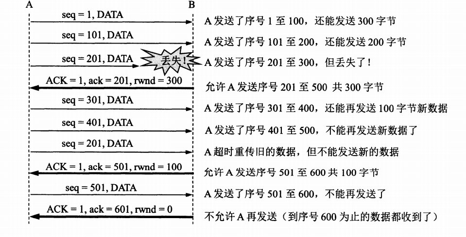

死锁


TCP和UDP区别


### 确保传输可靠性的方式

TCP协议保证数据传输可靠性的方式主要有：

- 校验和
- 序列号
- 确认应答
- 超时重传
- 连接管理
- 流量控制
- 拥塞控制


## HTTP格式

请求


响应


## HTTP 与 HTTPS 的区别

https://juejin.im/entry/58d7635e5c497d0057fae036

 1、https协议需要到ca申请证书，一般免费证书较少，因而需要一定费用。

 2、http是超文本传输协议，信息是明文传输，https则是具有安全性的ssl加密传输协议。

 3、http和https使用的是完全不同的连接方式，用的端口也不一样，前者是80，后者是443。

 4、http的连接很简单，是无状态的；HTTPS协议是由SSL+HTTP协议构建的可进行加密传输、身份认证的网络协议，比http协议安全。

## HTTP中Get与Post的区别

　**1**.根据HTTP规范，GET用于信息获取，而且应该是安全的和幂等的。

​	**2**.根据HTTP规范，POST表示可能修改变服务器上的资源的请求。

HTTP 并未规定不可以 GET 中发送 Body 内容，但却不少知名的工具不能用 GET 发送 Body 数据，所以大致的讲我们仍然不推荐使用 GET 携带 Body 内容，还有可能某些应用服务器也会忽略掉 GET 的 Body 数据

## HTTP1.0、HTTP1.1、HTTP2.0的关系和区别

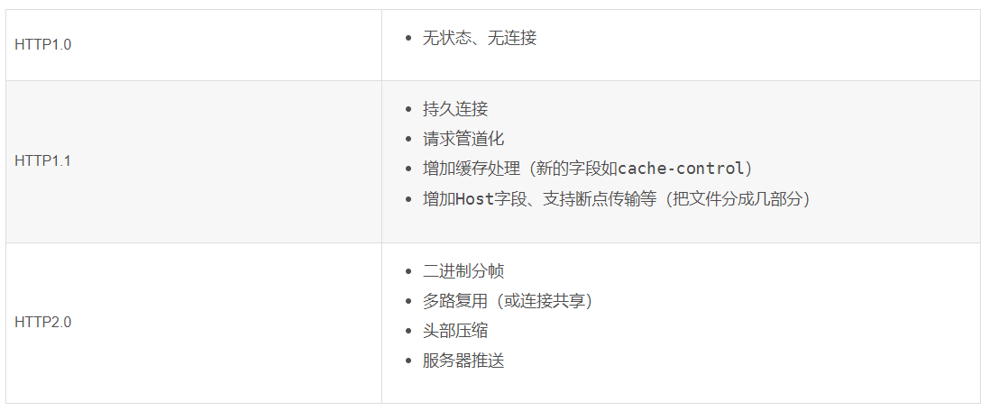


# Redis

## 数据结构

9种数据结构及其适用场景，string-对象json，hash-对象，list-消息队列，set-共同爱好，zset-排行榜，bitmap-活跃用户在线状态，hyperloglog（基数统计）-月活，bloom filter-解决缓存穿透 

## 主从复制实现

1.设置主服务器的地址和端口

2.建立套接字连接

3.发送Ping命令

4.身份验证

5.从服务器向主服务器发送端口信息，主服务器保存在自己的状态中

6.同步     第一次的话是全量同步，之后可以进行部分同步

全量同步  发送  PSYNC ? -1 

部分重同步    PSYNC<runid> <offset>  如果offset在主服务器的复制积压缓冲区中，就不能发起全量同步

7.命令传播

从服务器一直接受主服务器发来的写命令就行了


## 故障转移

1.选出新的主服务器 

有优先级的，如偏移量

领头哨兵对选择的主节点发送成为主节点的命令，当这个主节点返回的心跳信息包含自己是主节点的信息，证明选举成功

2.修改从服务器的复制目标

领头哨兵向其他从服务器发送命令

3.将旧的主服务器变为从服务器

## Redis为什么是单线程

CPU不是Redis的瓶颈。Redis的瓶颈最有可能是机器内存或者网络带宽，既然单线程容易实现，而且CPU不会成为瓶颈，那就顺理成章地采用单线程的方案了

## Redis为什么这么快

1、完全基于内存，绝大部分请求是纯粹的内存操作，非常快速。数据存在内存中，类似于HashMap，HashMap的优势就是查找和操作的时间复杂度都是O(1)；

2、数据结构简单，对数据操作也简单，Redis中的数据结构是专门进行设计的；

比如Redis 使用SDS而不是C字符串  这样可以减少修改字符串长度时所需的内存重新分配的次数

3、采用单线程，避免了不必要的上下文切换和竞争条件，也不存在多进程或者多线程导致的切换而消耗 CPU，不用去考虑各种锁的问题，不存在加锁释放锁操作，没有因为可能出现死锁而导致的性能消耗；

4、使用多路I/O复用模型，非阻塞IO；

Reactor模式

5、使用底层模型不同，它们之间底层实现方式以及与客户端之间通信的应用协议不一样，Redis直接自己构建了VM 机制 ，因为一般的系统调用系统函数的话，会浪费一定的时间去移动和请求；

<<<<<<< HEAD
## 缓存一致性

延时双删

在写库前后都进行redis.del(key)操作，并且设定合理的超时时间。具体步骤是：

1）先删除缓存

2）再写数据库

3）休眠500毫秒（根据具体的业务时间来定）

4）再次删除缓存。

**那么，这个500毫秒怎么确定的，具体该休眠多久呢？**

需要评估自己的项目的读数据业务逻辑的耗时。这么做的目的，就是确保读请求结束，写请求可以删除读请求造成的缓存脏数据。

当然，这种策略还要考虑 redis 和数据库主从同步的耗时。最后的写数据的休眠时间：则在读数据业务逻辑的耗时的基础上，加上几百ms即可。比如：休眠1秒。

## **skiplist与平衡树、哈希表的比较**

- skiplist和各种平衡树（如AVL、红黑树等）的元素是有序排列的，而哈希表不是有序的。因此，在哈希表上只能做单个key的查找，不适宜做范围查找。所谓范围查找，指的是查找那些大小在指定的两个值之间的所有节点。

- 在做范围查找的时候，平衡树比skiplist操作要复杂。在平衡树上，我们找到指定范围的小值之后，还需要以中序遍历的顺序继续寻找其它不超过大值的节点。如果不对平衡树进行一定的改造，这里的中序遍历并不容易实现。而在skiplist上进行范围查找就非常简单，只需要在找到小值之后，对第1层链表进行若干步的遍历就可以实现。

- 平衡树的插入和删除操作可能引发子树的调整，逻辑复杂，而skiplist的插入和删除只需要修改相邻节点的指针，操作简单又快速。

- 从内存占用上来说，skiplist比平衡树更灵活一些。一般来说，平衡树每个节点包含2个指针（分别指向左右子树），而skiplist每个节点包含的指针数目平均为1/(1-p)，具体取决于参数p的大小。如果像Redis里的实现一样，取p=1/4，那么平均每个节点包含1.33个指针，比平衡树更有优势。

- 查找单个key，skiplist和平衡树的时间复杂度都为O(log n)，大体相当；而哈希表在保持较低的哈希值冲突概率的前提下，查找时间复杂度接近O(1)，性能更高一些。所以我们平常使用的各种Map或dictionary结构，大都是基于哈希表实现的。

- 从算法实现难度上来比较，skiplist比平衡树要简单得多。

  
>>>>>>> 48513899db794c8653973c79b89cdc85675ea47c


# MyBatis

## 一二级缓存

https://www.jianshu.com/p/16ff1fc9e13c

https://www.jianshu.com/p/16ff1fc9e13c

一级


二级

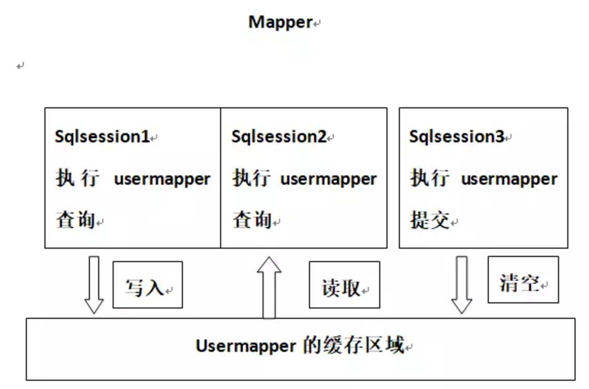

# 数据结构

## 排序

https://juejin.im/post/5b95da8a5188255c775d8124#comment

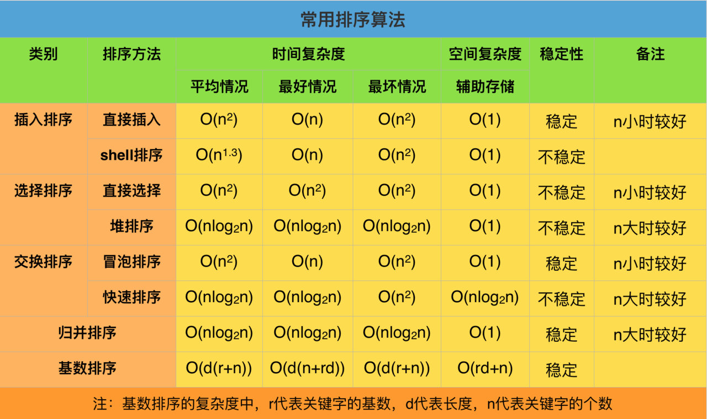

### 冒泡排序

```
package com.fufu.algorithm.sort;

import java.util.Arrays;

/**
 * 冒泡排序
 * Created by zhoujunfu on 2018/8/2.
 */
public class BubbleSort {
    public static void sort(int[] array) {
        if (array == null || array.length == 0) {
            return;
        }

        int length = array.length;
        //外层：需要length-1次循环比较
        for (int i = 0; i < length - 1; i++) {
            //内层：每次循环需要两两比较的次数，每次比较后，都会将当前最大的数放到最后位置，所以每次比较次数递减一次
            for (int j = 0; j < length - 1 - i; j++) {
                if (array[j] > array[j+1]) {
                    //交换数组array的j和j+1位置的数据
                    swap(array, j, j+1);
                }
            }
        }
    }

    /**
     * 交换数组array的i和j位置的数据
     * @param array 数组
     * @param i 下标i
     * @param j 下标j
     */
    public static void swap(int[] array, int i, int j) {
        int temp = array[i];
        array[i] = array[j];
        array[j] = temp;
    }
}


```

### 快速排序

```
/**
 * 快速排序
 * Created by zhoujunfu on 2018/8/6.
 */
public class QuickSort {
    /**
     * 快速排序（左右指针法）
     * @param arr 待排序数组
     * @param low 左边界
     * @param high 右边界
     */
    public static void sort2(int arr[], int low, int high) {
        if (arr == null || arr.length <= 0) {
            return;
        }
        if (low >= high) {
            return;
        }

        int left = low;
        int right = high;

        int key = arr[left];

        while (left < right) {
            while (left < right && arr[right] >= key) {
                right--;
            }
            while (left < right && arr[left] <= key) {
                left++;
            }
            if (left < right) {
                swap(arr, left, right);
            }
        }
        swap(arr, low, left);
        System.out.println("Sorting: " + Arrays.toString(arr));
        sort2(arr, low, left - 1);
        sort2(arr, left + 1, high);
    }

    public static void swap(int arr[], int low, int high) {
        int tmp = arr[low];
        arr[low] = arr[high];
        arr[high] = tmp;
    }
}

```

### 直接插入排序

```
public static void sort(int[] a) {
        if (a == null || a.length == 0) {
            return;
        }

        for (int i = 1; i < a.length; i++) {
            int j = i - 1;
            int temp = a[i]; // 先取出待插入数据保存，因为向后移位过程中会把覆盖掉待插入数
            while (j >= 0 && a[j] > temp) { // 如果待是比待插入数据大，就后移
                a[j+1] = a[j];
                j--;
            }
            a[j+1] = temp; // 找到比待插入数据小的位置，将待插入数据插入
        }
    }


```

### 希尔排序

```
 /**
     * 希尔排序
     *
     * @param num
     */
    public static void ShellSort(int num[]) {
        int temp;
        //默认步长为数组长度除以2
        int step = num.length;
        while (true) {
            step = step / 2;
            //确定分组数
            for (int i = 0; i < step; i++) {
                //对分组数据进行直接插入排序
                for ( int j = i + step; j < num.length; j = j + step) {
                    temp=num[j];
                    int k;
                   for( k=j-step;k>=0;k=k-step){
                       if(num[k]>temp){
                           num[k+step]=num[k];
                       }else{
                           break;
                       }
                   }
                   num[k+step]=temp;
                }
            }
            if (step == 1) {
                break;
            }
        }
    }


```

### 选择排序

```
public class SelectSort {
    public static void sort(int[] arr) {
        for (int i = 0; i < arr.length - 1; i++) {
            int min = i;
            for (int j = i+1; j < arr.length; j ++) { //选出之后待排序中值最小的位置
                if (arr[j] < arr[min]) {
                    min = j;
                }
            }
            if (min != i) {
                arr[min] = arr[i] + arr[min];
                arr[i] = arr[min] - arr[i];
                arr[min] = arr[min] - arr[i];
            }
        }
    }

```

### 排序算法稳定性的作用

举个例子，一个班的学生已经按照学号大小排好序了，我现在要求按照年龄从小到大再排个序，如果年龄相同的，必须按照学号从小到大的顺序排列。那么问题来了，你选择的年龄排序方法如果是不稳定的，是不是排序完了后年龄相同的一组学生学号就乱了，你就得把这组年龄相同的学生再按照学号拍一遍。如果是稳定的排序算法，我就只需要按照年龄排一遍就好了。

从一个键上排序，然后再从另一个键上排序，第一个键排序的结果可以为第二个键排序所用。要排序的内容是一个复杂对象的多个数字属性，且其原本的初始顺序存在意义，那么我们需要在二次排序的基础上保持原有排序的意义，才需要使用到稳定性的算法。

有很多算法你现在看着没啥，但是当放在大数据云计算的条件下它的稳定性非常重要。举个例子来说，对淘宝网的商品进行排序，按照销量，价格等条件进行排序，它的数据服务器中的数据非常多，因此，当时用一个稳定性效果不好的排序算法，如堆排序、shell排序，当遇到最坏情形，会使得排序的效果非常差，严重影响服务器的性能，影响到用户的体验。

## MD5算法原理

https://juejin.im/entry/59cf56a26fb9a00a4a4ceb64

# ZooKeeper

## 解决的问题

分布式数据一致性


## 使用场景

1.数据的订阅和发布

配置中心

2.软负载均衡

3.命名服务

全局id

## 原子操作


每个节点都有版本号，所以原子操作是通过CAS,当然也可以加锁，如果是加锁version就是-1

## Watcher


# 操作系统

## 死锁

死锁是指两个或两个以上的进程在执行过程中，由于竞争资源或者由于彼此通信而造成的一种阻塞的现象，若无外力作用，它们都将无法推进下去。

## 虚拟内存

我们可以把进程所使用的地址「隔离」开来，即让操作系统为每个进程分配独立的一套「**虚拟地址**」，人人都有，大家自己玩自己的地址就行，互不干涉。

## 段页

https://mp.weixin.qq.com/s/oexktPKDULqcZQeplrFunQ

段


- 外部内存碎片，也就是产生了多个不连续的小物理内存，导致新的程序无法被装载；
- 内部内存碎片，程序所有的内存都被装载到了物理内存，但是这个程序有部分的内存可能并不是很常使用，这也会导致内存的浪费；

解决外部内存碎片的问题就是**内存交换**。

页


有空间上的缺陷。

因为操作系统是可以同时运行非常多的进程的，那这不就意味着页表会非常的庞大。

这时用多级页


段页


- 第一次访问段表，得到页表起始地址；
- 第二次访问页表，得到物理页号；
- 第三次将物理页号与页内位移组合，得到物理地址。

## 进程间通信的方式

1，管道

      1，匿名管道：
    
                 概念：在内核中申请一块固定大小的缓冲区，程序拥有写入和读取的权利，一般使用fork函数实现父子进程的通信。


​                            

      2，命名管道： 
    
                  概念：在内核中申请一块固定大小的缓冲区，程序拥有写入和读取的权利，没有血缘关系的进程也可以进程间通信。


​                                 

      3，特点：


                1，面向字节流，
    
                2，生命周期随内核
    
                3，自带同步互斥机制。
    
                4，半双工，单向通信，两个管道实现双向通信。


2，消息队列

  1，概念：在内核中创建一队列，队列中每个元素是一个数据报，不同的进程可以通过句柄去访问这个队列。

                 消息队列提供了⼀个从⼀个进程向另外⼀个进程发送⼀块数据的⽅法。
    
                  每个数据块都被认为是有⼀个类型，接收者进程接收的数据块可以有不同的类型值                          


​                               

                  消息队列也有管道⼀样的不⾜，就是每个消息的最⼤⻓度是有上限的（MSGMAX），
    
                  每个消息队 列的总的字节数是有上限的（MSGMNB），系统上消息队列的总数也有⼀个上限（MSGMNI）
    
    2，特点：
    
              1， 消息队列可以认为是一个全局的一个链表，链表节点钟存放着数据报的类型和内容，有消息队列的标识符进行标记。
    
              2，消息队列允许一个或多个进程写入或者读取消息。
    
              3，消息队列的生命周期随内核。
    
              4，消息队列可实现双向通信。
3，信号量     

        1，概念
    
                      在内核中创建一个信号量集合（本质是个数组），数组的元素（信号量）都是1，使用P操作进行-1，使用V操作+1，
    
                      （1） P(sv)：如果sv的值⼤大于零，就给它减1；如果它的值为零，就挂起该进程的执⾏ 。
                      （2） V(sv)：如果有其他进程因等待sv而被挂起，就让它恢复运⾏，如果没有进程因等待sv⽽挂起，就给它加1。
    
                           PV操作用于同一进程，实现互斥。
    
                          PV操作用于不同进程，实现同步。
    
         2，功能：
    
                        对临界资源进行保护。       
4，共享内存      

       1，概念：
    
                  将同一块物理内存一块映射到不同的进程的虚拟地址空间中，实现不同进程间对同一资源的共享。
    
                  共享内存可以说是最有用的进程间通信方式，也是最快的IPC形式。
    
        2，特点：
    
                 1，不用从用户态到内核态的频繁切换和拷贝数据，直接从内存中读取就可以。
    
                 2，共享内存是临界资源，所以需要操作时必须要保证原子性。使用信号量或者互斥锁都可以。
    
                 3，生命周期随内核。     


## Sleep(0)

**调用sleep（0）可以释放cpu时间，让线程马上重新回到就绪队列而非等待队列，sleep(0)释放当前线程所剩余的时间片（如果有剩余的话），这样可以让操作系统切换其他线程来执行，提升效率。**

## 虚拟内存

**虚拟内存为每个进程提供了一个一致的、私有的地址空间，它让每个进程产生了一种自己在独享主存的错觉（每个进程拥有一片连续完整的内存空间）**。

理解不深刻的人会认为虚拟内存只是“使用硬盘空间来扩展内存“的技术，这是不对的。**虚拟内存的重要意义是它定义了一个连续的虚拟地址空间**，使得程序的编写难度降低。并且，**把内存扩展到硬盘空间只是使用虚拟内存的必然结果，虚拟内存空间会存在硬盘中，并且会被内存缓存（按需），有的操作系统还会在内存不够的情况下，将某一进程的内存全部放入硬盘空间中，并在切换到该进程时再从硬盘读取**（这也是为什么Windows会经常假死的原因...）。

作者：SylvanasSun
链接：https://juejin.im/post/59f8691b51882534af254317
来源：掘金
著作权归作者所有。商业转载请联系作者获得授权，非商业转载请注明出处。


## 信号与信号量的区别

1.信号：（signal）是一种处理异步事件的方式。信号是比较复杂的通信方式，

用于通知接受进程有某种事件发生，除了用于进程外，还可以发送信号给进程本身。

 

2.信号量：（Semaphore）进程间通信处理同步互斥的机制。

是在多线程环境下使用的一种设施, 它负责协调各个线程, 以保证它们能够正确、合理的使用公共资源。

## Cache一致性协议之MESI

https://blog.csdn.net/muxiqingyang/article/details/6615199


## 进程切换与线程切换

**进程切换分两步：**

**1.切换页目录以使用新的地址空间**

**2.切换内核栈和硬件上下文**

对于linux来说，线程和进程的最大区别就在于地址空间，对于线程切换，第1步是不需要做的，第2是进程和线程切换都要做的。

## 进程和线程的主要区别

根本区别：进程是操作系统资源分配的基本单位，而线程是任务调度和执行的基本单位

在开销方面：每个进程都有独立的代码和数据空间（程序上下文），程序之间的切换会有较大的开销；线程可以看做轻量级的进程，同一类线程共享代码和数据空间，每个线程都有自己独立的运行栈和程序计数器（PC），线程之间切换的开销小。

所处环境：在操作系统中能同时运行多个进程（程序）；而在同一个进程（程序）中有多个线程同时执行（通过CPU调度，在每个时间片中只有一个线程执行）

内存分配方面：系统在运行的时候会为每个进程分配不同的内存空间；而对线程而言，除了CPU外，系统不会为线程分配内存（线程所使用的资源来自其所属进程的资源），线程组之间只能共享资源。

包含关系：没有线程的进程可以看做是单线程的，如果一个进程内有多个线程，则执行过程不是一条线的，而是多条线（线程）共同完成的；线程是进程的一部分，所以线程也被称为轻权进程或者轻量级进程。

https://juejin.im/post/5d5df6b35188252ae10bdf42#comment

## Linux 系统启动过程

https://www.runoob.com/linux/linux-system-boot.html

    内核的引导。
    运行 init。
    系统初始化。
    建立终端 。
    用户登录系统。

##  Reactor模式详解

https://www.cnblogs.com/winner-0715/p/8733787.html	

## **5种IO模型对比**

https://mp.weixin.qq.com/s?__biz=Mzg3MjA4MTExMw==&mid=2247484746&idx=1&sn=c0a7f9129d780786cabfcac0a8aa6bb7&source=41#wechat_redirect


# 设计模式

## 单例模式

```
public class Singleton implement Serializable{
    private static volatile Singleton instance = null;
    private Singleton(){}
    public static Singleton getInstance() {
        if (instance == null) {
            synchronized (Singleton.class) {
                if (instance == null) {
                    instance = new Singleton();
                }
            }
        }
        return instance;
    }
    private Object readResolve(){
		retutn getInstance();
	}
}
```

1. 分配对象内存
2. 调用构造器方法，执行初始化
3. 将对象引用赋值给变量。

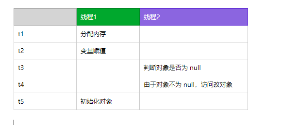

内部类

```
public class Singleton{
    private static class SingletonHolder{
        public static Singleton instance = new Singleton();
    }
    private Singleton(){}
    public static Singleton newInstance(){
        return SingletonHolder.instance;
    }
}
```

枚举

```
public enum Singleton{
    instance;
    public void whateverMethod(){}    
}
```

# 计算机组成原理

## 	寻址方式

 1   立即数寻址
   操作数就在指令中，作为指令的一部分，跟在操作码后存放在代码段。
  eg.   mov ah,01h
       mov ax,1204h 
      ;如果立即数是16位的，则高地址放在高位，低地址放在低位

 2   寄存器寻址
   操作数在寄存器中，指令中指定寄存器号。对于8位操作数，寄存器可以是AL,AH,BL,BH,
  CL,CH,DL,DH。 对于16位操作数，寄存器可以是AX,BX,CX,DX,BP,SP,SI,DI等
   eg.   mov ah,ch
       mov bx,ax

 3   直接寻址方式
   操作数在存储器中，指令直接包含操作数的有效地址EA。
  eg.   mov ax,[1122h]   ;将ds:1122的数据放在ax，默认段为DS
       mov es:[1234],al ;采用了段前缀

 4   寄存器间接寻址
   操作数在存储器中，操作数的有效地址在SI,DI,BX,BP这4个寄存器之一中。在不采用段前
  缀的情况下， 对于DI,SI,BX默认段为DS,而BP为SS。
   eg.   mov ah,[bx]
       mov ah,cs:[bx] ;使用了段前缀

 5   寄存器相对寻址
   操作数在存储器中，操作数的有效地址是一个基址寄存器(BX,BP)或变址寄存器(SI,DI)的
  内容加上8位或16位的位移之和。在指令中的8位和16位的常量采用补码表示，8位要被带
  符号扩展为16位。
  eg.   mov ah,[bx+6]
       ;段址默认情况与寄存器间接寻址相同

 6   基址加变址寻址
   操作数在存储器中，操作数的有效地址是一个基址寄存器(BX,BP)加上变址寄存器(SI,DI)的
  内容。如果有BP，则默认段址为SS,否则为DS.
  eg.   mov ah,[bx+si]

 7   相对基址加变址寻址
   操作数在存储器中，操作数的有效地址是一个基址寄存器(BX,BP)和变址寄存器(SI,DI)的
  内容加上8位或16位的位移之和。如果有BP，则默认段址为SS,否则为DS.
  eg.   mov ax,[bx+di-2]
       mov ax,1234h[bx][di]


# Java

## 异常


## 集合方法使用

https://www.liaoxuefeng.com/wiki/1252599548343744/1265112034799552

## 集合


### hashmap


**1.8get**

https://juejin.im/post/5b551e8df265da0f84562403#heading-6

判断当前桶是否为空，空的就需要初始化（resize 中会判断是否进行初始化）。

根据当前 key 的 hashcode 定位到具体的桶中并判断是否为空，为空表明没有 Hash 冲突就直接在当前位置创建一个新桶即可。

如果当前桶有值（ Hash 冲突），那么就要比较当前桶中的 `key、key 的 hashcode` 与写入的 key 是否相等，相等就赋值给 `e`,在第 8 步的时候会统一进行赋值及返回。

如果当前桶为红黑树，那就要按照红黑树的方式写入数据。

如果是个链表，就需要将当前的 key、value 封装成一个新节点写入到当前桶的后面（形成链表）。

接着判断当前链表的大小是否大于预设的阈值，大于时就要转换为红黑树。

如果在遍历过程中找到 key 相同时直接退出遍历。

如果 `e != null` 就相当于存在相同的 key,那就需要将值覆盖。

最后判断是否需要进行扩容。

**get**

首先将 key hash 之后取得所定位的桶。

如果桶为空则直接返回 null 。

否则判断桶的第一个位置(有可能是链表、红黑树)的 key 是否为查询的 key，是就直接返回 value。

如果第一个不匹配，则判断它的下一个是红黑树还是链表。

红黑树就按照树的查找方式返回值。

不然就按照链表的方式遍历匹配返回值。

### ConcurrentHashMap

**put**

根据 key 计算出 hashcode 。

判断是否需要进行初始化。

当前 key 定位出的 Node，如果为空表示当前位置可以写入数据，利用 CAS 尝试写入，失败则自旋保证成功。

如果当前位置的 `hashcode == MOVED == -1`,则需要进行扩容。

如果都不满足，则利用 synchronized 锁写入数据。

如果数量大于 `TREEIFY_THRESHOLD` 则要转换为红黑树。

**get**

- 根据计算出来的 hashcode 寻址，如果就在桶上那么直接返回值。
- 如果是红黑树那就按照树的方式获取值。
- 就不满足那就按照链表的方式遍历获取值。

深入分析ConcurrentHashMap1.8的扩容实现

https://www.jianshu.com/p/f6730d5784ad

## 线程池

### 线程池数量

最佳线程数目 = （（线程等待时间+线程CPU时间）/线程CPU时间 ）* CPU数目

## Full GC的触发条件

> **当准备要触发一次 young GC时，如果发现统计数据说之前 young GC的平均晋升大小比目前的 old gen剩余的空间大，则不会触发young GC而是转为触发 full GC** (因为HotSpot VM的GC里，除了垃圾回收器 CMS的concurrent collection 之外，其他能收集old gen的GC都会同时收集整个GC堆，包括young gen，所以不需要事先准备一次单独的young GC)

> **如果有永久代(perm gen),要在永久代分配空间但已经没有足够空间时，也要触发一次 full GC**

> **System.gc()，heap dump带GC,其默认都是触发 full GC.**

## Minor GC的触发条件

当 Eden 区的空间耗尽，这个时候 Java虚拟机便会触发一次 **Minor GC**来收集新生代的垃圾，存活下来的对象，则会被送到 Survivor区。


## **volatile**

1、防止重排序

2、实现可见性


（1）LoadLoad 屏障
执行顺序：Load1—>Loadload—>Load2
确保Load2及后续Load指令加载数据之前能访问到Load1加载的数据。

（2）StoreStore  屏障
执行顺序：Store1—>StoreStore—>Store2
确保Store2以及后续Store指令执行前，Store1操作的数据对其它处理器可见。

（3）LoadStore 屏障
执行顺序： Load1—>LoadStore—>Store2
确保Store2和后续Store指令执行前，可以访问到Load1加载的数据。

（4）StoreLoad 屏障
执行顺序: Store1—> StoreLoad—>Load2
确保Load2和后续的Load指令读取之前，Store1的数据对其他处理器是可见的。

#### 原子操作的实现原理                                                                                                    

**（1）使用总线锁保证原子性**

第一个机制是通过总线锁保证原子性。如果多个处理器同时对共享变量进行读改写操作（i++就是经典的读改写操作），那么共享变量就会被多个处理器同时进行操作，这样读改写操作就不是原子的，操作完之后共享变量的值会和期望的不一致。那么，想要保证读改写共享变量的操作是原子的，就必须保证CPU1读改写共享变量的时候，CPU2不能操作缓存了该共享变量内存地址的缓存。处理器使用总线锁就是来解决这个问题的。**所谓总线锁就是使用处理器提供的一个LOCK＃信号，当一个处理器在总线上输出此信号时，其他处理器的请求将被阻塞住，那么该处理器可以独占共享内存。**

**（2）使用缓存锁保证原子性**

第二个机制是通过缓存锁定来保证原子性。在同一时刻，我们只需保证对某个内存地址的操作是原子性即可，但总线锁定把CPU和内存之间的通信锁住了，这使得锁定期间，其他处理器不能操作其他内存地址的数据，所以**总线锁定的开销比较大**，目前处理器在某些场合下使用缓存锁定代替总线锁定来进行优化。**所谓“缓存锁定”是指内存区域如果被缓存在处理器的缓存行中，并且在Lock操作期间被锁定，那么当它执行锁操作回写到内存时，处理器不在总线上声言LOCK＃信号，而是修改内部的内存地址，并允许它的缓存一致性机制来保证操作的原子性，因为缓存一致性机制会阻止同时修改由两个以上处理器缓存的内存区域数据，当其他处理器回写已被锁定的缓存行的数据时，会使缓存行无效。**

嗅探

来的处理器都提供了缓存锁定机制，也就说当某个处理器对缓存中的共享变量进行了操作，其他处理器会有个嗅探机制，将其他处理器的该共享变量的缓存失效，待其他线程读取时会重新从主内存中读取最新的数据，基于 MESI 缓存一致性协议来实现的。

嗅探过程

https://www.jianshu.com/p/537897436132

## sleep()和wait()


两者都可以让线程暂停一段时间,但是本质的区别是一个线程的运行状态控制,一个是线程之间的通讯的问题

## 轻量级锁

https://www.bbsmax.com/A/A2dmM7lbde/


## AQS

AQS，全称：AbstractQueuedSynchronizer，是JDK提供的一个同步框架，内部维护着FIFO双向队列，即CLH同步队列。

AQS依赖它来完成同步状态的管理（voliate修饰的state，用于标志是否持有锁）。如果获取同步状态state失败时，会将当前线程及等待信息等构建成一个Node，将Node放到FIFO队列里，同时阻塞当前线程，当线程将同步状态state释放时，会把FIFO队列中的首节的唤醒，使其获取同步状态state。
很多JUC包下的锁都是基于AQS实现的

在AQS中维护着一个FIFO的同步队列，当线程获取同步状态失败后，则会加入到这个CLH同步队列的对尾并一直保持着自旋。在CLH同步队列中的线程在自旋时会判断其前驱节点是否为首节点，如果为首节点则不断尝试获取同步状态，获取成功则退出CLH同步队列。当线程执行完逻辑后，会释放同步状态，释放后会唤醒其后继节点。 

共享式同步状态过程
共享式与独占式的最主要区别在于同一时刻独占式只能有一个线程获取同步状态，而共享式在同一时刻可以有多个线程获取同步状态。例如读操作可以有多个线程同时进行，而写操作同一时刻只能有一个线程进行写操作，其他操作都会被阻塞。 


## **类需要同时满足下面3个条件才能算是 “无用的类” ：**

1.该类所有的实例都已经被回收，也就是 Java 堆中不存在该类的任何实例。

2.加载该类的 ClassLoader 已经被回收。

3.该类对应的 java.lang.Class 对象没有在任何地方被引用，无法在任何地方通过反射访问该类的方法。

 

**如何判断一个常量是废弃常量：**

运行时常量池主要回收的是废弃的常量。那么，我们如何判断一个常量是废弃常量呢?

假如在常量池中存在字符串"abc" ,如果当前没有任何String对象引用该字符串常量的话，就说明常量"abc"就是废弃常量,如果这时发生内存回收的话而且有必要的话，" abc"就会被系统清理出常量池。

## 反射

反射机制是在运行状态中，对于任意一个类，都能够知道这个类的所有属性和方法；对于任意一个对象，都能够调用它的任意一个方法和属性；这种动态获取的信息以及动态调用对象的方法的功能称为java语言的反射机制。

功能

①、在运行时判断任意一个对象所属的类
 ②、在运行时构造任意一个类的对象
 ③、在运行时判断任意一个类所具有的成员变量和方法（通过反射设置可以调用 private）
 ④、在运行时调用人一个对象的方法

 反射的缺点
　　1.性能第一:反射包括了一些动态类型，所以 JVM 无法对这些代码进行优化。因此，反射操作的 效率要比那些非反射操作低得多。我们应该避免在经常被 执行的代码或对性能要求很高的程 序中使用反射。
　　2.安全限制:使用反射技术要求程序必须在一个没有安全限制的环境中运行。如果一个程序必须在有安全限制的环境中运行，如 Applet，那么这就是个问题了
　　3.内部暴露:由于反射允许代码执行一些在正常情况下不被允许的操作（比如访问私有的属性和方法），所以使用反射可能会导致意料之外的副作用－－代码有功能上的错误，降低可移植性。 反射代码破坏了抽象性，因此当平台发生改变的时候，代码的行为就有可能也随着变化。

## 双亲委派

过程

源ClassLoader先判断该Class是否已加载，如果已加载，则返回Class对象；如果没有则委托给父类加载器。
父类加载器判断是否加载过该Class，如果已加载，则返回Class对象；如果没有则委托给祖父类加载器。
依此类推，直到始祖类加载器（引用类加载器）。
始祖类加载器判断是否加载过该Class，如果已加载，则返回Class对象；如果没有则尝试从其对应的类路径下寻找class字节码文件并载入。如果载入成功，则返回Class对象；如果载入失败，则委托给始祖类加载器的子类加载器。
始祖类加载器的子类加载器尝试从其对应的类路径下寻找class字节码文件并载入。如果载入成功，则返回Class对象；如果载入失败，则委托给始祖类加载器的孙类加载器。
依此类推，直到源ClassLoader。
源ClassLoader尝试从其对应的类路径下寻找class字节码文件并载入。如果载入成功，则返回Class对象；如果载入失败，源ClassLoader不会再委托其子类加载器，而是抛出异常。

当一个类加载器去加载类时先尝试让父类加载器去加载，如果父类加载器加载不了再尝试自身加载。这也是我们在自定义ClassLoader时java官方建议遵守的约定。

双亲委派模型能保证基础类仅加载一次，不会让jvm中存在重名的类。比如String.class，每次加载都委托给父加载器，最终都是BootstrapClassLoader，都保证java核心类都是BootstrapClassLoader加载的，保证了java的安全与稳定性。

自己实现ClassLoader时只需要继承ClassLoader类，然后覆盖findClass（String name）方法即可完成一个带有双亲委派模型的类加载器。

破坏双亲委派模型

1代码热替换，在不重启服务器的情况下可以修改类的代码并使之生效。

热部署步骤：

1. 销毁自定义classloader(被该加载器加载的class也会自动卸载)；
2. 更新class
3. 使用新的ClassLoader去加载class

JVM中的Class只有满足以下三个条件，才能被GC回收，也就是该Class被卸载（unload）：

- 该类所有的实例都已经被GC，也就是JVM中不存在该Class的任何实例。
- 加载该类的ClassLoader已经被GC。
- 该类的java.lang.Class 对象没有在任何地方被引用，如不能在任何地方通过反射访问该类的方法

2JDBC

- 第一，从META-INF/services/java.sql.Driver文件中获取具体的实现类名“com.mysql.jdbc.Driver”
- 第二，加载这个类，这里肯定只能用class.forName("com.mysql.jdbc.Driver")来加载

好了，问题来了，Class.forName()加载用的是调用者的Classloader，这个调用者DriverManager是在rt.jar中的，ClassLoader是启动类加载器，而com.mysql.jdbc.Driver肯定不在/lib下，所以肯定是无法加载mysql中的这个类的。这就是双亲委派模型的局限性了，父级加载器无法加载子级类加载器路径中的类。

那么，这个问题如何解决呢？按照目前情况来分析，这个mysql的drvier只有应用类加载器能加载，那么我们只要在启动类加载器中有方法获取应用程序类加载器，然后通过它去加载就可以了。这就是所谓的线程上下文加载器。

**线程上下文类加载器让父级类加载器能通过调用子级类加载器来加载类，这打破了双亲委派模型的原则**

简单的说就是破坏了可见性

3tomcat中的每个项目之间能加载不用的lib

## 全盘负责

“全盘负责”是指当一个ClassLoader装载一个类时，除非显示地使用另一个ClassLoader，则该类所依赖及引用的类也由这个CladdLoader载入。

例如，系统类加载器AppClassLoader加载入口类（含有main方法的类）时，会把main方法所依赖的类及引用的类也载入，依此类推。“全盘负责”机制也可称为当前类加载器负责机制。显然，入口类所依赖的类及引用的类的当前类加载器就是入口类的类加载器。
————————————————
版权声明：本文为CSDN博主「zhangzeyuaaa」的原创文章，遵循CC 4.0 BY-SA版权协议，转载请附上原文出处链接及本声明。
原文链接：https://blog.csdn.net/zhangzeyuaaa/article/details/42499839

## 有了基本类型为什么还要有包装类？

逻辑上来讲，java只有包装类就够了，为了运行速度，需要用到基本数据类型。

我们都知道在Java语言中，new一个对象存储在堆里，我们通过栈中的引用来使用这些对象。但是对于经常用到的一系列类型如int、boolean… 如果我们用new将其存储在堆里就不是很高效——特别是简单的小的变量。所以，同C++ 一样Java也采用了相似的做法，决定基本数据类型不是用new关键字来创建，而是直接将变量的值存储在栈中，方法执行时创建，结束时销毁，因此更加高效。
————————————————
版权声明：本文为CSDN博主「田潇文」的原创文章，遵循CC 4.0 BY-SA版权协议，转载请附上原文出处链接及本声明。
原文链接：https://blog.csdn.net/weixin_44259720/article/details/87009843

## Arrays.asList为什么不能增加或者修改

1.返回的是内部类，而内部类对元素的定义是final

```
private final E[] a;
```

2.Arrays继承了AbstractList<E>，而在AbstractList中U对add方法天然就会抛出异常“throw new UnsupportedOperationException();”，平时我们使用的都是ArrayList的add方法，它是进行了重写；

## Random在高并发下的缺陷以及JUC对其的优化

    protected int next(int bits) {
        long oldseed, nextseed;//定义旧种子，下一个种子
        AtomicLong seed = this.seed;
        do {
            oldseed = seed.get();//获得旧的种子值，赋值给oldseed 
            nextseed = (oldseed * multiplier + addend) & mask;//一个神秘的算法
        } while (!seed.compareAndSet(oldseed, nextseed));//CAS，如果seed的值还是为oldseed，就用nextseed替换掉，并且返回true，退出while循环，如果已经不为oldseed了，就返回false，继续循环
        return (int)(nextseed >>> (48 - bits));//一个神秘的算法
    }


定义了旧种子oldseed，下一个种子（新种子）nextseed。

获得旧的种子的值，赋值给oldseed 。

一个神秘的算法，计算出下一个种子（新种子）赋值给nextseed。

使用CAS操作，如果seed的值还是oldseed，就用nextseed替换掉，并且返回true，！true为false，退出while循环；如果seed的值已经不为oldseed了，就说明seed的值已经被替换过了，返回false，！false为true，继续下一次while循环。

一个神秘的算法，根据nextseed计算出随机数，并且返回。

作者：CoderBear
链接：https://juejin.im/post/5cbc1e3bf265da039d32819c
来源：掘金
著作权归作者所有。商业转载请联系作者获得授权，非商业转载请注明出处。

CAS会有竞争

优化：

ThreadLocalRandom中，把probe和seed设置到当前的线程，这样其他线程就拿不到了。


## 抽象类和接口的区别

比较
从定义上看

抽象类是包含抽象方法的类；
接口是抽象方法和全局变量的集合。

从组成上看

抽象类由构造方法、抽象方法、普通方法、常量和变量构成；
接口由常量、抽象方法构成，在 JDK 1.8 以后，接口里可以有静态方法和方法体。

从使用上看

子类继承抽象类（extends）;
子类实现接口（implements）。

从关系上看

抽象类可以实现多个接口；
接口不能继承抽象类，但是允许继承多个接口。

从局限上看

抽象类有单继承的局限；
接口没有单继承的限制。

区分
类是对对象的抽象，抽象类是对类的抽象；

接口是对行为的抽象。

若行为跨越不同类的对象，可使用接口；

对于一些相似的类对象，用继承抽象类。

抽象类是从子类中发现了公共的东西，泛化出父类，然后子类继承父类；

接口是根本不知子类的存在，方法如何实现还不确认，预先定义。


## 内存溢出排查

一般什么情况可能是出现了溢出呢？
超时，不进行服务，服务挂掉，接口不在服务这样的异常问题。

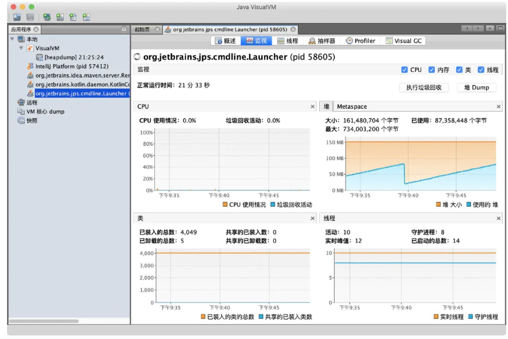


可以看到内存得不到释放

使用dump可以定位到哪一行代码

内存溢出的解决方案：

第一步，修改JVM启动参数，直接增加内存。(-Xms，-Xmx参数一定不要忘记加。)

第二步，检查错误日志，查看“OutOfMemory”错误前是否有其它异常或错误。

第三步，对代码进行走查和分析，找出可能发生内存溢出的位置。

重点排查以下几点：

1.检查对数据库查询中，是否有一次获得全部数据的查询。一般来说，如果一次取十万条记录到内存，就可能引起内存溢出。这个问题比较隐蔽，在上线前，数据库中数据较少，不容易出问题，上线后，数据库中数据多了，一次查询就有可能引起内存溢出。因此对于数据库查询尽量采用分页的方式查询。

2.检查代码中是否有死循环或递归调用。

3.检查是否有大循环重复产生新对象实体。

4.检查List、MAP等集合对象是否有使用完后，未清除的问题。List、MAP等集合对象会始终存有对对象的引用，使得这些对象不能被GC回收。

第四步，使用内存查看工具动态查看内存使用情况


## 偏向锁

https://www.jianshu.com/p/e62fa839aa41

**在大多数情况下，锁不仅不存在多线程竞争，而且总是由同一线程多次获得**，为了让线程获得锁的代价更低，引进了偏向锁。

引入偏向锁主要目的是：**为了在没有多线程竞争的情况下尽量减少不必要的轻量级锁执行路径**。因为轻量级锁的加锁解锁操作是需要依赖多次CAS原子指令的，**而偏向锁只需要在置换ThreadID的时候依赖一次CAS原子指令**

流程

**检测Mark Word是否为可偏向状态**，即是否为偏向锁1，锁标识位为01；

**若为可偏向状态，则测试线程ID是否为当前线程ID**，如果是，则执行步骤（5），否则执行步骤（3）；

**如果测试线程ID不为当前线程ID**，则通过CAS操作竞争锁，竞争成功，则将Mark Word的线程ID替换为当前线程ID，否则执行线程（4）；

**通过CAS竞争锁失败，证明当前存在多线程竞争情况，当到达全局安全点，获得偏向锁的线程被挂起，偏向锁升级为轻量级锁**，然后被阻塞在安全点的线程继续往下执行同步代码块；

执行同步代码块；

## 轻量级锁

引入轻量级锁的主要目的是 **在没有多线程竞争的前提下，减少传统的重量级锁使用操作系统互斥量产生的性能消耗**。

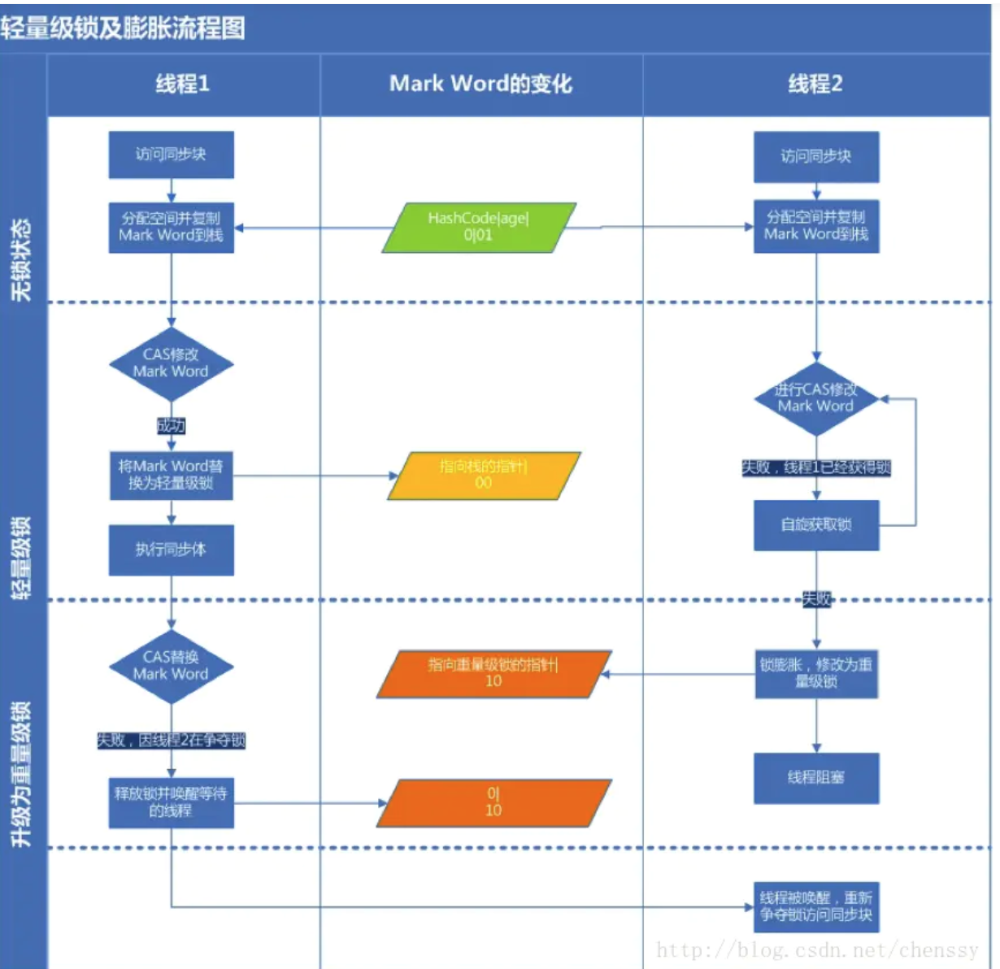

**为什么升级为轻量锁时要把对象头里的Mark Word复制到线程栈的锁记录中呢**？

> 因为在申请对象锁时 **需要以该值作为CAS的比较条件**，同时在升级到重量级锁的时候，**能通过这个比较判定是否在持有锁的过程中此锁被其他线程申请过**，如果被其他线程申请了，则在释放锁的时候要唤醒被挂起的线程。

此处，如何理解“轻量级”？**“轻量级”是相对于使用操作系统互斥量来实现的传统锁而言的**。但是，首先需要强调一点的是，**轻量级锁并不是用来代替重量级锁的，它的本意是在没有多线程竞争的前提下，减少传统的重量级锁使用产生的性能消耗**。

> **轻量级锁所适应的场景是线程交替执行同步块的情况，如果存在同一时间访问同一锁的情况，必然就会导致轻量级锁膨胀为重量级锁**。

## 重量级锁

Synchronized是通过对象内部的一个叫做 **监视器锁（Monitor）来实现的**。**但是监视器锁本质又是依赖于底层的操作系统的Mutex Lock来实现的。而操作系统实现线程之间的切换这就需要从用户态转换到核心态，这个成本非常高，状态之间的转换需要相对比较长的时间**，这就是为什么Synchronized效率低的原因。因此，这种依赖于操作系统Mutex Lock所实现的锁我们称之为 **“重量级锁”**。

mutex互斥锁一句话：保护共享资源。


作者：猿码架构
链接：https://www.jianshu.com/p/e62fa839aa41
来源：简书
著作权归作者所有。商业转载请联系作者获得授权，非商业转载请注明出处。

作者：猿码架构
链接：https://www.jianshu.com/p/e62fa839aa41
来源：简书
著作权归作者所有。商业转载请联系作者获得授权，非商业转载请注明出处。

## Cas坏处

Core1和Core2可能会同时把主存中某个位置的值Load到自己的L1 Cache中，**当Core1在自己的L1 Cache中修改这个位置的值时，会通过总线，使Core2中L1 Cache对应的值“失效”，而Core2一旦发现自己L1 Cache中的值失效（称为Cache命中缺失）则会通过总线从内存中加载该地址最新的值，大家通过总线的来回通信称为“Cache一致性流量”**，因为总线被设计为固定的“通信能力”，**如果Cache一致性流量过大，总线将成为瓶颈**。而当Core1和Core2中的值再次一致时，称为“Cache一致性”，**从这个层面来说，锁设计的终极目标便是减少Cache一致性流量**。

而CAS恰好会导致Cache一致性流量，如果有很多线程都共享同一个对象，当某个Core CAS成功时必然会引起总线风暴，**这就是所谓的本地延迟，本质上偏向锁就是为了消除CAS，降低Cache一致性流量**。

1简单的说就是会引起中线风暴

2空循环


# Mysql

## 储存格式

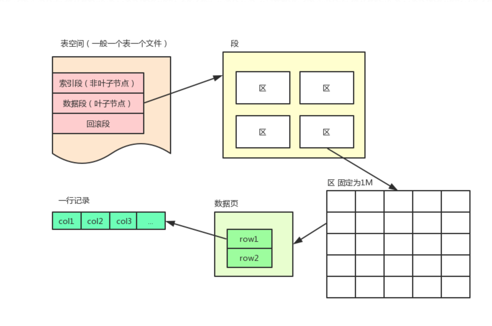

## SQL语句执行过程

​	客户端发送一条查询给服务器。

服务器先检查查询缓存，如果命中了缓存，则立刻返回存储在缓存中的结果。否则进入下一阶段。

服务器端进行SQL解析、预处理，再由优化器生成对应的执行计划。

MySQL根据优化器生成的执行计划，再调用存储引擎的API来执行查询。

将结果返回给客户端。

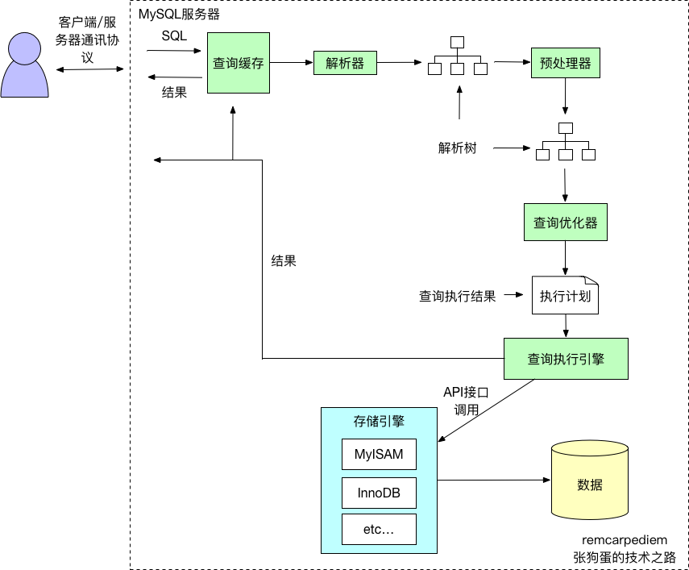

作者：程序员历小冰
链接：https://juejin.im/post/5b7036de6fb9a009c40997eb
来源：掘金
著作权归作者所有。商业转载请联系作者获得授权，非商业转载请注明出处。

## 索引为什么选择了B+树

http://www.gxlcms.com/mysql-366759.html

- **更少的IO次数：**B+树的非叶节点只包含键，而不包含真实数据，因此每个节点存储的记录个数比B数多很多（即阶m更大），因此B+树的高度更低，访问时所需要的IO次数更少。此外，由于每个节点存储的记录数更多，所以对访问局部性原理的利用更好，缓存命中率更高。
- **更适于范围查询：**在B树中进行范围查询时，首先找到要查找的下限，然后对B树进行中序遍历，直到找到查找的上限；而B+树的范围查询，只需要对链表进行遍历即可。
- **更稳定的查询效率：**B树的查询时间复杂度在1到树高之间(分别对应记录在根节点和叶节点)，而B+树的查询复杂度则稳定为树高，因为所有数据都在叶节点。

B+树也存在劣势：由于键会重复出现，因此会占用更多的空间。但是与带来的性能优势相比，空间劣势往往可以接受，因此B+树的在数据库中的使用比B树更加广泛。

## MySQL中myisam与innodb的区别

(1)、问5点不同；


1>.InnoDB支持事物，而MyISAM不支持事物


2>.InnoDB支持行级锁，而MyISAM支持表级锁


3>.InnoDB支持MVCC, 而MyISAM不支持

4>.InnoDB支持外键，而MyISAM不支持

(2)、innodb引擎的4大特性
插入缓冲（insert buffer),二次写(double write),自适应哈希索引(ahi),预读(read ahead)
(3)、2者selectcount(*)哪个更快，为什么
myisam更快，因为myisam内部维护了一个计数器，可以直接调取。

如何选择：

如果是只读，表小，可以容忍修复操作 选择myisam

## 二次写理解

https://www.jianshu.com/p/7d87e2603cdd

## explain详解

https://www.jianshu.com/p/be1c86303c80

## 事务

事务：是数据库操作的最小工作单元，是作为单个逻辑工作单元执行的一系列操作；这些操作作为一个整体一起向系统提交，要么都执行、要么都不执行；事务是一组不可再分割的操作集合（工作逻辑单元）；

## 索引失效

NOT条件

LIKE通配符

条件上包括函数

数据类型的转换

当查询条件存在隐式转换时，索引会失效。比如在数据库里id存的number类型，但是在查询时，却用了下面的形式：

```
select * from sunyang where id='123';
```

如果mysql觉得全表扫描更快时（数据少）

索引统计的误差大

## mvcc实现原理

https://zhuanlan.zhihu.com/p/64576887

版本链
  对于使用InnoB引擎的表来说，它的聚簇索引记录中都包含两个必要的隐藏列：

    trx_id：每次一个事务对某条聚簇索引记录进行改动时，都会把该事务的事务id赋值给trx_id隐藏列；即记录事务ID。
    roll_pointer：每次对某条聚簇索引记录进行改动时，都会把旧的版本写入到undo日志中，然后这个隐藏列就相当于一个指针，可以通过它来找到该记录修改前的信息。

  每次对记录改动，都会记录一条undo日志，每条undo日志也都有一个roll_pointer属性（INSERT操作对应的undo日志没有该属性，因为该记录并没有更早的版本），将这条数据的undo日志组成一个链表；即为版本链。版本链的头节点就是当前记录的最新值。

## 日志 redo undo binlog

https://mp.weixin.qq.com/s/Lx4TNPLQzYaknR7D3gmOmQ

`binlog`记载的是`update/delete/insert`这样的SQL语句，而`redo log`记载的是物理修改的内容（xxxx页修改了xxx）。

所以在搜索资料的时候会有这样的说法：`redo log` 记录的是数据的**物理变化**，`binlog` 记录的是数据的**逻辑变化**


`undo log`主要有两个作用：回滚和多版本控制(MVCC)

`undo log`主要存储的也是逻辑日志，比如我们要`insert`一条数据了，那`undo log`会记录的一条对应的`delete`日志。我们要`update`一条记录时，它会记录一条对应**相反**的update记录。

### binlog和redo log 写入的细节 

`redo log`**事务开始**的时候，就开始记录每次的变更信息，而`binlog`是在**事务提交**的时候才记录。

于是新有的问题又出现了：我写其中的某一个`log`，失败了，那会怎么办？现在我们的前提是先写`redo log`，再写`binlog`，我们来看看：

- 如果写`redo log`失败了，那我们就认为这次事务有问题，回滚，不再写`binlog`。
- 如果写`redo log`成功了，写`binlog`，写`binlog`写一半了，但失败了怎么办？我们还是会对这次的**事务回滚**，将无效的`binlog`给删除（因为`binlog`会影响从库的数据，所以需要做删除操作）
- 如果写`redo log`和`binlog`都成功了，那这次算是事务才会真正成功。

简单来说：MySQL需要保证`redo log`和`binlog`的**数据是一致**的，如果不一致，那就乱套了。

- 如果`redo log`写失败了，而`binlog`写成功了。那假设内存的数据还没来得及落磁盘，机器就挂掉了。那主从服务器的数据就不一致了。（从服务器通过`binlog`得到最新的数据，而主服务器由于`redo log`没有记载，没法恢复数据）
- 如果`redo log`写成功了，而`binlog`写失败了。那从服务器就拿不到最新的数据了。

MySQL通过**两阶段提交**来保证`redo log`和`binlog`的数据是一致的。

## 两种复制方式

语句复制

简单的说就是复制sql语句

好处：

1.实现简单

2.占用宽带少

3.兼容表中列顺序不同的情况

坏处：

1.有些sql语句无法复制，如当前的时间戳，rand,uuid函数

行复制

好处：

1.几乎没有无法复制的场景

2.减少锁的使用，不要求串行

3.如果找不到对应的行，基于行复制会停止，而语句的复制则不会。

坏处

1.无法判断执行了什么sql语句

2.占用宽带多

举个例子，如update操作，语句只用发条语句，行的话可能要发送全部的行

## 复制的过程


过滤是为了过滤一些数据库权限的语句

## 备库升级主库

计划中

1停止向主库写

2让备库追上主库

3将一台备库升级为主库

4把写操作指向新的主库

计划外

1找到数据最新的备库

2让所有备库先重发好在之前主库的数据

3追赶新的主库

4把写操作指向新的主库

## Mvcc和next-key lock为什么不能完全解决幻读

https://blog.csdn.net/weixin_42907817/article/details/107121470

如果基于锁来控制的话，当对某个记录进行修改的时候，另一个事务将需要等待，不管他是要读取还是写入，MVCC 允许写入的时候还能够进行读操作，这对大部分都是查询操作的应用来说极大的提高了 tps 。

## 为什么不建议使用订单号作为主键?

如果主键是一个很长的字符串并且建了很多普通索引，将造成普通索引占有很大的物理空间，这也是为什么建议使用 自增ID 来替代订单号作为主键，另一个原因是 自增ID 在插入的时候可以保证相邻的两条记录可能在同一个数据块，而订单号的连续性在设计上可能没有自增ID好，导致连续插入可能在多个数据块，增加了磁盘读写次数。

不自增也会导致，B+树的分页等

## 排序

排序有好多种算法来实现，在 MySQL 中经常会带上一个 limit ,表示从排序后的结果集中取前 100 条，或者取第 n 条到第 m 条，要实现排序，我们需要先根据查询条件获取结果集，然后在内存中对这个结果集进行排序，如果结果集数量特别大，还需要将结果集写入到多个文件里，然后单独对每个文件里的数据进行排序，然后在文件之间进行归并，排序完成后在进行 limit 操作。没错，这个就是 MySQL 实现排序的方式，前提是排序的字段没有索引。

```undefined
CREATE TABLE `person` (
  `id` int(11) NOT NULL,
  `city` varchar(16) NOT NULL,
  `name` varchar(16) NOT NULL,
  `age` int(11) NOT NULL,
  `addr` varchar(128) DEFAULT NULL,
  PRIMARY KEY (`id`),
  KEY `city` (`city`)
) ENGINE=InnoDB;

select city,name,age from person where city='武汉' order by name limit 100  ;
```

使用 explain 发现该语句会使用 city 索引，并且会有 filesort . 我们分析下该语句的执行流程

- 1.初始化 sortbuffer ，用来存放结果集

- 2.找到 city 索引，定位到 city 等于武汉的第一条记录，获取主键索引ID

- 3.根据 ID 去主键索引上找到对应记录，取出 city,name,age 字段放入 sortbuffer

- 4.在 city 索引取下一个 city 等于武汉的记录的主键ID

- 5.重复上面的步骤，直到所有 city 等于武汉的记录都放入 sortbuffer

- 6.对 sortbuffer 里的数据根据 name 做快速排序

- 7.根据排序结果取前面 1000 条返回

  这里是查询 city,name,age 3个字段，比较少，如果查询的字段较多，则多个列如果都放入 sortbuffer 将占有大量内存空间，另一个方案是只区出待排序的字段和主键放入 sortbuffer 这里是 name 和 id ,排序完成后在根据 id 取出需要查询的字段返回，其实就是时间换取空间的做法，这里通过 max_length_for_sort_data 参数控制，是否采用后面的方案进行排序。

另外如果 sortbuffer 里的条数很多，同样会占有大量的内存空间，可以通过参数 sort_buffer_size 来控制是否需要借助文件进行排序，这里会把 sortbuffer 里的数据放入多个文件里，用归并排序的思路最终输出一个大的文件。

以上方案主要是 name 字段没有加上索引，如果 name 字段上有索引，由于索引在构建的时候已经是有序的了，所以就不需要进行额外的排序流程只需要在查询的时候查出指定的条数就可以了，这将大大提升查询速度。我们现在加一个 city 和 name 的联合索引。

```undefined
alter table person add index city_user(city, name);
```

这样查询过程如下：

- 1.根据 city,name 联合索引定位到 city 等于武汉的第一条记录，获取主键索引ID
- 2.根据 ID 去主键索引上找到对应记录，取出 city,name,age 字段作为结果集返回
- 3.继续重复以上步骤直到 city 不等于武汉，或者条数大于 1000

由于联合所以在构建索引的时候，在 city 等于武汉的索引节点中的数据已经是根据 name 进行排序了的，所以这里只需要直接查询就可，另外这里如果加上 city, name, age 的联合索引，则可以用到索引覆盖，不行到主键索引上进行回表。

总结一下，我们在有排序操作的时候，最好能够让排序字段上建有索引，另外由于查询第一百万条开始的一百条记录，需要过滤掉前面一百万条记录，即使用到索引也很慢，所以可以根据 ID 来进行区分，分页遍历的时候每次缓存上一次查询结果最后一条记录的 id ， 下一次查询加上 id > xxxx limit 0,1000 这样可以避免前期扫描到的结果被过滤掉的情况。

## 数据库死锁场景


我们分析一下：

- 从第③步中可以看出，`Session A`中的事务先对`hero`表聚簇索引的`id`值为1的记录加了一个`X型正经记录锁`。

- 从第④步中可以看出，`Session B`中的事务对`hero`表聚簇索引的`id`值为3的记录加了一个`X型正经记录锁`。

- 从第⑤步中可以看出，`Session A`中的事务接着想对`hero`表聚簇索引的`id`值为3的记录也加了一个`X型正经记录锁`，但是与第④步中`Session B`中的事务加的锁冲突，所以`Session A`进入阻塞状态，等待获取锁。

- 从第⑥步中可以看出，`Session B`中的事务想对`hero`表聚簇索引的`id`值为1的记录加了一个`X型正经记录锁`，但是与第③步中`Session A`中的事务加的锁冲突，而此时`Session A`和`Session B`中的事务循环等待对方持有的锁，死锁发生，被`MySQL`服务器的死锁检测机制检测到了，所以选择了一个事务进行回滚，并向客户端发送一条消息：

  ```
  ERROR 1213 (40001): Deadlock found when trying to get lock; try restarting transaction
  ```


作者：小孩子4919
链接：https://juejin.im/post/5d8082bc6fb9a06b032031a2
来源：掘金
著作权归作者所有。商业转载请联系作者获得授权，非商业转载请注明出处。


# Spring

## 初始化

IOC容器的初始化分为三个过程实现：
第一个过程是Resource资源定位。这个Resouce指的是BeanDefinition的资源定位。这个过程就是容器找数据的过程，就像水桶装水需要先找到水一样。
第二个过程是BeanDefinition的载入过程。这个载入过程是把用户定义好的Bean表示成Ioc容器内部的数据结构，而这个容器内部的数据结构就是BeanDefition。
第三个过程是向IOC容器注册这些BeanDefinition的过程，这个过程就是将前面的BeanDefition保存到HashMap中的过程。
 BeanDefinition:
SpringIOC 容器管理了我们定义的各种 Bean 对象及其相互的关系，Bean 对象在 Spring 实现中是以 BeanDefinition 来描述的。
BeanDefinition定义了Bean的数据结构，用来存储Bean。
Bean 的解析过程非常复杂，Bean 的解析主要就是对 Spring 配置文件的解析,使用BeanDefinitionReader对资源文件进行解析。

一：Resource定位
想要构建BeanDefinition，需要先找到配置文件，也就是通常所说的applicationContetx.xml等配置文件
二：BeanDefinition载入
找到资源文件之后，后面的就是解析这个文件并将其转化为容器支持的BeanDifination结构，可以分为一下三步：
1.构造一个BeanFactory,也就是IOC容器
2.调用XML解析器得到document对象   XmlBeanDefinitionReader
3.按照Spring的规则解析document对象为容器支持的BeanDefition类型
三：向IOC容器注册BeanDefition
在IOC容器中有一个map，用于存放所有的BeanDefinition，方便容器对Bean进行管理


先找到资源配置文件，然后使用BeanDefinationReader对配置文件进行解析得到容器支持的BeanDefination结构，最后把解析完成的所有的BeanDefination放入容器的一个map容器中便于容器对bean进行统一的管理

Spring ioc容器实例化Bean有几种方式：singleton   prototype  request  session  globalSession
主要用到的是：singleton：单例，IOC容器之中有且仅有一个Bean实例  prototype：每次从bean容器中调用bean时，都返回一个新的实例，IOC容器默认为singleton


## 传播机制

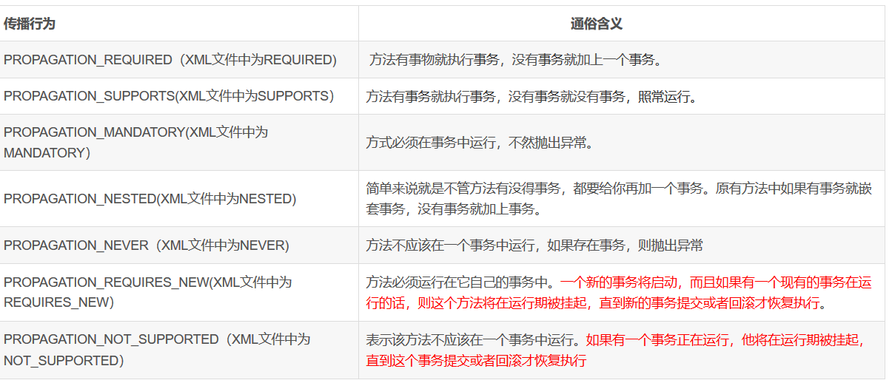


## bean初始化

https://www.jianshu.com/p/9ea61d204559

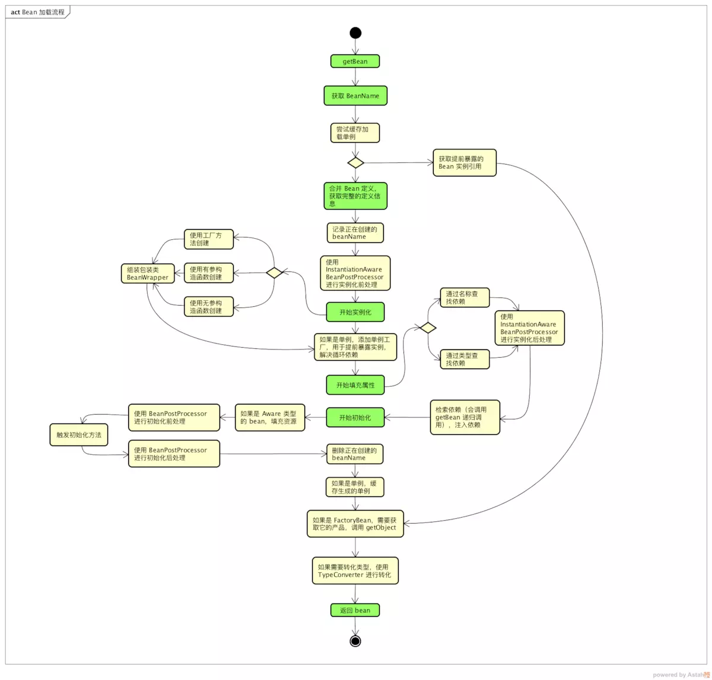

## springMVC

https://www.jianshu.com/p/8a20c547e245

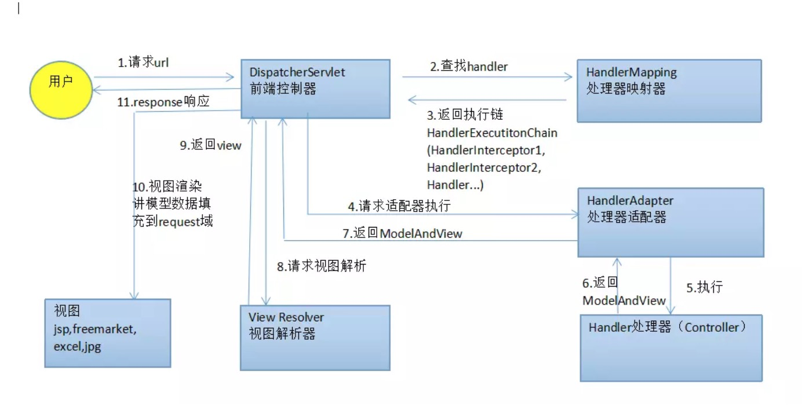


## Spring和Springboot区别

Spring Boot可以建立独立的Spring应用程序；
内嵌了如Tomcat，Jetty和Undertow这样的容器，也就是说可以直接跑起来，用不着再做部署工作了；
无需再像Spring那样搞一堆繁琐的xml文件的配置；
可以自动配置Spring。SpringBoot将原有的XML配置改为Java配置，将bean注入改为使用注解注入的方式(@Autowire)，并将多个xml、properties配置浓缩在一个appliaction.yml配置文件中。
提供了一些现有的功能，如量度工具，表单数据验证以及一些外部配置这样的一些第三方功能；
整合常用依赖（开发库，例如spring-webmvc、jackson-json、validation-api和tomcat等），提供的POM可以简化Maven的配置。当我们引入核心依赖时，SpringBoot会自引入其他依赖。
————————————————
版权声明：本文为CSDN博主「zj_daydayup」的原创文章，遵循CC 4.0 BY-SA版权协议，转载请附上原文出处链接及本声明。
原文链接：https://blog.csdn.net/u012556994/article/details/81353002

## AOP 原理

[http://www.tianxiaobo.com/2018/01/18/%E8%87%AA%E5%B7%B1%E5%8A%A8%E6%89%8B%E5%AE%9E%E7%8E%B0%E7%9A%84-Spring-IOC-%E5%92%8C-AOP-%E4%B8%8B%E7%AF%87/#comments](http://www.tianxiaobo.com/2018/01/18/自己动手实现的-Spring-IOC-和-AOP-下篇/#comments)

1. AOP 逻辑介入 BeanFactory 实例化 bean 的过程
2. 根据 Pointcut 定义的匹配规则，判断当前正在实例化的 bean 是否符合规则
3. 如果符合，代理生成器将切面逻辑 Advice 织入 bean 相关方法中，并为目标 bean 生成代理对象
4. 将生成的 bean 的代理对象返回给 BeanFactory 容器，到此，AOP 逻辑执行结束

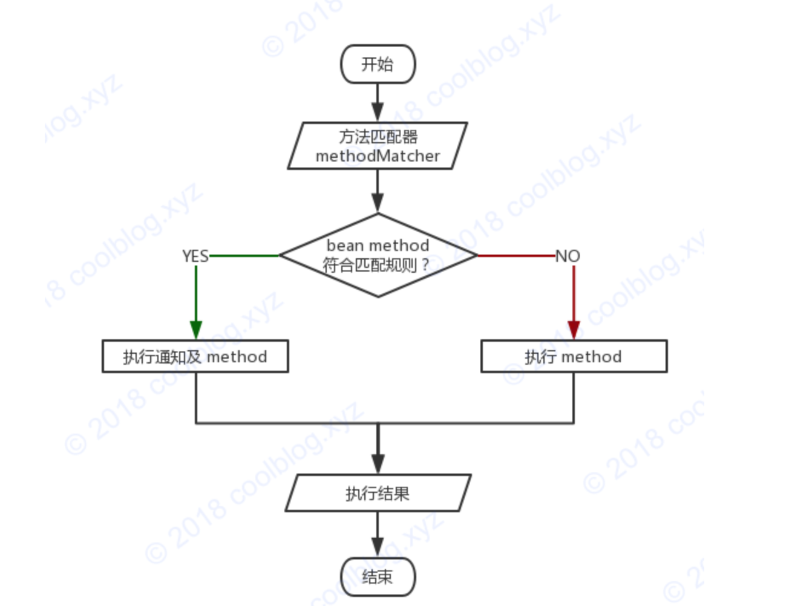

## BeanDefinition 及其他一些类的介绍


上图中的 ref 对应的 BeanReference 对象。BeanReference 对象保存的是 bean 配置中 ref 属性对应的值，在后续 BeanFactory 实例化 bean 时，会根据 BeanReference 保存的值去实例化 bean 所依赖的其他 bean。

接下来说说 PropertyValues 和 PropertyValue 这两个长的比较像的类，首先是PropertyValue。PropertyValue 中有两个字段 name 和 value，用于记录 bean 配置中的标签的属性值。然后是PropertyValues，PropertyValues 从字面意思上来看，是 PropertyValue 复数形式，在功能上等同于 List。那么为什么 Spring 不直接使用 List，而自己定义一个新类呢？答案是要获得一定的控制权，看下面的代码：

```
public class PropertyValues {

    private final List<PropertyValue> propertyValueList = new ArrayList<PropertyValue>();

    public void addPropertyValue(PropertyValue pv) {
        // 在这里可以对参数值 pv 做一些处理，如果直接使用 List，则就不行了
        this.propertyValueList.add(pv);
    }

    public List<PropertyValue> getPropertyValues() {
        return this.propertyValueList;
    }

}
```

## xml 的解析

1. 将 xml 配置文件加载到内存中
2. 获取根标签下所有的标签
3. 遍历获取到的标签列表，并从标签中读取 id，class 属性
4. 创建 BeanDefinition 对象，并将刚刚读取到的 id，class 属性值保存到对象中
5. 遍历标签下的标签，从中读取属性值，并保持在 BeanDefinition 对象中
6. 将 <id, BeanDefinition> 键值对缓存在 Map 中，留作后用
7. 重复3、4、5、6步，直至解析结束

# 算法

## LRU

```
// 继承LinkedHashMap
    public class LRUCache<K, V> extends LinkedHashMap<K, V> {
        private final int MAX_CACHE_SIZE;

        public LRUCache(int cacheSize) {
            // 使用构造方法 public LinkedHashMap(int initialCapacity, float loadFactor, boolean accessOrder)
            // initialCapacity、loadFactor都不重要
            // accessOrder要设置为true，按访问排序
            super((int) Math.ceil(cacheSize / 0.75) + 1, 0.75f, true);
            MAX_CACHE_SIZE = cacheSize;
        }

        @Override
        protected boolean removeEldestEntry(Map.Entry eldest) {
            // 超过阈值时返回true，进行LRU淘汰
            return size() > MAX_CACHE_SIZE;
        }

    }
```


```
public class LRUCache {
    class DLinkedNode {
        int key;
        int value;
        DLinkedNode prev;
        DLinkedNode next;
        public DLinkedNode() {}
        public DLinkedNode(int _key, int _value) {key = _key; value = _value;}
    }

    private Map<Integer, DLinkedNode> cache = new HashMap<Integer, DLinkedNode>();
    private int size;
    private int capacity;
    private DLinkedNode head, tail;

    public LRUCache(int capacity) {
        this.size = 0;
        this.capacity = capacity;
        // 使用伪头部和伪尾部节点
        head = new DLinkedNode();
        tail = new DLinkedNode();
        head.next = tail;
        tail.prev = head;
    }

    public int get(int key) {
        DLinkedNode node = cache.get(key);
        if (node == null) {
            return -1;
        }
        // 如果 key 存在，先通过哈希表定位，再移到头部
        moveToHead(node);
        return node.value;
    }

    public void put(int key, int value) {
        DLinkedNode node = cache.get(key);
        if (node == null) {
            // 如果 key 不存在，创建一个新的节点
            DLinkedNode newNode = new DLinkedNode(key, value);
            // 添加进哈希表
            cache.put(key, newNode);
            // 添加至双向链表的头部
            addToHead(newNode);
            ++size;
            if (size > capacity) {
                // 如果超出容量，删除双向链表的尾部节点
                DLinkedNode tail = removeTail();
                // 删除哈希表中对应的项
                cache.remove(tail.key);
                --size;
            }
        }
        else {
            // 如果 key 存在，先通过哈希表定位，再修改 value，并移到头部
            node.value = value;
            moveToHead(node);
        }
    }

    private void addToHead(DLinkedNode node) {
        node.prev = head;
        node.next = head.next;
        head.next.prev = node;
        head.next = node;
    }

    private void removeNode(DLinkedNode node) {
        node.prev.next = node.next;
        node.next.prev = node.prev;
    }

    private void moveToHead(DLinkedNode node) {
        removeNode(node);
        addToHead(node);
    }

    private DLinkedNode removeTail() {
        DLinkedNode res = tail.prev;
        removeNode(res);
        return res;
    }
}

```

### 死锁

```
class main{

    static Object  lock1=new Object ();
    static Object  lock2=new Object ();
    static Object  lock3=new Object ();

    static class DeadLock1 implements Runnable{

        @Override
        public void run() {
            synchronized (lock1){
                try {
                    Thread.sleep(1000);
                } catch (InterruptedException e) {
                    e.printStackTrace();
                }
                synchronized (lock2){
                    System.out.println(1);
                }
            }
        }
    }

    static class DeadLock2 implements Runnable{
        @Override
        public void run() {
            synchronized (lock2){
                try {
                    Thread.sleep(1000);
                } catch (InterruptedException e) {
                    e.printStackTrace();
                }
                synchronized (lock1){
                    System.out.println(2);
                }
            }
        }
    }

    /**
     * 解决死锁
     * @param lock1
     * @param lock2
     */
    private static void lock(Object lock1,Object lock2){

        if(lock1.hashCode()<lock2.hashCode()) {
            synchronized (lock2) {
                try {
                    Thread.sleep(1000);
                } catch (InterruptedException e) {
                    e.printStackTrace();
                }
                synchronized (lock1) {
                    System.out.println(2);
                }
            }
        }else if(lock1.hashCode()>lock2.hashCode()){
            synchronized (lock1) {
                try {
                    Thread.sleep(1000);
                } catch (InterruptedException e) {
                    e.printStackTrace();
                }
                synchronized (lock2) {
                    System.out.println(2);
                }
            }
        }else {
            synchronized (lock3){
                synchronized (lock1) {
                    try {
                        Thread.sleep(1000);
                    } catch (InterruptedException e) {
                        e.printStackTrace();
                    }
                    synchronized (lock2) {
                        System.out.println(2);
                    }
                }
            }
        }
    }


    public static void main(String[] args) {
        Thread thread1=new Thread(new DeadLock1());
        Thread thread2=new Thread(new DeadLock2());
        thread1.start();
        thread2.start();
    }


}
```

### 堆溢出

```
class main{
    public static void main(String[] args) {
        int i = 1;
        List<byte[]> list = new ArrayList<byte[]>();

        while (true) {
            list.add(new byte[10 * 1024 * 1024]);
            System.out.println("第" + (i++) + "次分配");
        }
    }
}
```

### 栈溢出

```
class main{
    static int depth = 0;

    public void countMethod() {
        depth++;
        countMethod();
    }

    public static void main(String[] args) {
        main demo = new main();
        try{
            demo.countMethod();
        }finally {
            System.out.println("方法执行了"+depth+"次");
        }

    }

}

```

### 常量池溢出

```
class main{

    public static void main(String[] args) {
        List<String> list=new ArrayList<>();
        long i=0;
        while(true){
            list.add(String.valueOf(i).intern());
        }

    }

}

```

### 红包算法

　红包形成的队列不应该是从小到大或者从大到小，需要有大小的随机性。

红包这种金钱类的需要用Decimal保证精确度。

考虑红包分到每个人手上的最小的最大的情况。

下面是利用线段分割算法实现的分红包， 比如把100元红包，分给十个人，就相当于把（0-100）这个线段随机分成十段，也就是再去中找出9个随机点。

找随机点的时候要考虑碰撞问题，如果碰撞了就重新随机（当前我用的是这个方法）。这个方法也更方便抑制红包金额MAX情况，如果金额index-start>MAX,就直接把红包设为最大值MAX，

然后随机点重置为start+MAX，保证所有红包金额相加等于总金额。

```

    import java.math.BigDecimal;
    import java.util.*;
     
    public class RedPaclage{
        public static List<Integer>  divideRedPackage(int allMoney, int peopleCount,int MAX) {
            //人数比钱数多则直接返回错误
            if(peopleCount<1||allMoney<peopleCount){
                System.out.println("钱数人数设置错误！");
                return null;
            }
            List<Integer> indexList = new ArrayList<>();
            List<Integer> amountList = new ArrayList<>();
            Random random = new Random();
            for (int i = 0; i < peopleCount - 1; i++) {
                int index;
                do{
                    index = random.nextInt(allMoney - 2) + 1;
                }while (indexList.contains(index));//解决碰撞
                indexList.add(index);
            }
            Collections.sort(indexList);
            int start = 0;
            for (Integer index:indexList) {
                    //解决最大红包值
                if(index-start>MAX){
                    amountList.add(MAX);
                    start=start+MAX;
                }else{
                    amountList.add(index-start);
                    start = index;
                }
            }
            amountList.add(allMoney-start);
            return amountList;
        }
        public static void main(String args[]){
            Scanner in=new Scanner(System.in);
            int n=Integer.parseInt(in.nextLine());
            int pnum=Integer.parseInt(in.nextLine());
            int money=n*100;int max=n*90;
            List<Integer> amountList = divideRedPackage(money, pnum,max);
            if(amountList!=null){
                for (Integer amount : amountList) {
                    System.out.println("抢到金额：" + new BigDecimal(amount).divide(new BigDecimal(100)));
                }
            }
     
        }
    }


```

### kmp

```
class Solution {
    public int strStr(String haystack, String needle) {
    if(needle.length()==0){
        return 0;
    }
    if(haystack.length()==0){
        return -1;
    }
    int M = needle.length();
    int N = haystack.length();
    // pat 的初始态为 0
    char[] txt=haystack.toCharArray();
    char[] pat=needle.toCharArray();
    int[] next=getNext(pat,M);
    int j = 0,i=0;
    while(i<N&&j<M){
        if(j==-1||txt[i]==pat[j]){
            i++;
            j++;
        }else{
            j=next[j];
        }
    }
    if(j==M){
        return i-j;
    }else{
        return -1;
    }
    }

    private int[] getNext(char[] p,int m){
        int[] next=new int[m];
        next[0]=-1;
        int k=-1,j=0;
        while(j<m-1){
            if (k == -1 || p[j] == p[k]) 
		{
			++k;
			++j;
			next[j] = k;
		}else 
		{
			k = next[k];
		}
        }
        return next;
    }
}
```

### 生产者消费者

https://blog.csdn.net/ldx19980108/article/details/81707751?depth_1-utm_source=distribute.pc_relevant.none-task&utm_source=distribute.pc_relevant.none-task

```
class Storage{
    private final int MAX_SIZE=10;

    private Deque<Integer> list=new LinkedList<>();

    private int rangeSize=99;

    private Random random=new Random();

    public void produce(){
        synchronized(list){
            while(list.size()>=MAX_SIZE){
                System.out.println("【生产者" + Thread.currentThread().getName()
                        + "】仓库已满");
                try {
                    list.wait();
                } catch (InterruptedException e) {
                    e.printStackTrace();
                }
            }
            list.add(random.nextInt(rangeSize));
            System.out.println("【生产者" + Thread.currentThread().getName()
                    + "】生产一个产品，现库存" + list.size());
            list.notifyAll();
        }
    }

    public void consume(){
        synchronized (list){
            while(list.size()==0){
                System.out.println("【消费者" + Thread.currentThread().getName()
                        + "】仓库为空");
                try {
                    list.wait();
                } catch (InterruptedException e) {
                    e.printStackTrace();
                }
            }
            list.remove();
            System.out.println("【消费者" + Thread.currentThread().getName()
                    + "】消费一个产品，现库存" + list.size());
            list.notifyAll();
        }
    }
}


class Producer implements Runnable{
    private Storage storage;

    public Producer(){}

    public Producer(Storage storage ){
        this.storage = storage;
    }

    @Override
    public void run(){
        while (true){
            try {
                Thread.sleep(1000);
                storage.produce();
            } catch (InterruptedException e) {
                e.printStackTrace();
            }
        }
    }
}

class Consumer implements Runnable{
    private Storage storage;

    public Consumer(){}

    public Consumer(Storage storage ){
        this.storage = storage;
    }

    @Override
    public void run(){
        while(true){
            try{
                Thread.sleep(3000);
                storage.consume();
            }catch (InterruptedException e){
                e.printStackTrace();
            }
        }
    }
}


class main{

    public static void main(String[] args) {
        Storage storage = new Storage();
        Thread p1 = new Thread(new Producer(storage));
        Thread p2 = new Thread(new Producer(storage));
        Thread p3 = new Thread(new Producer(storage));

        Thread c1 = new Thread(new Consumer(storage));
        Thread c2 = new Thread(new Consumer(storage));
        Thread c3 = new Thread(new Consumer(storage));

        p1.start();
        p2.start();
        p3.start();
        c1.start();
        c2.start();
        c3.start();
    }

}


```

### 树的非递归遍历

前序

```
class Solution {
    public List<Integer> preorderTraversal(TreeNode root) {
        LinkedList<Integer> result=new LinkedList<>();
        Stack<TreeNode> stack=new Stack<>();
        TreeNode cur=root;
        while(!stack.isEmpty()||cur!=null){
            if(cur!=null){
                result.addLast(cur.val);
                stack.push(cur);
                cur=cur.left; 
            }else{
                cur=stack.pop();
                cur=cur.right;
            }
        }
        return result;
    }
}
```

中序

```
public List<Integer> inorderTraversal(TreeNode root) {
        List<Integer> result=new ArrayList<>();
        Stack<TreeNode> stack=new Stack<>();
        TreeNode cur=root;
        while(cur!=null||!stack.isEmpty()){
          while(cur!=null){
              stack.push(cur);
              cur=cur.left;
          }
          cur=stack.pop();
          result.add(cur.val);
          cur=cur.right;
        }
        return result;
    }
```

后序

前序遍历顺序为：根 -> 左 -> 右

后序遍历顺序为：左 -> 右 -> 根

如果1： 我们将前序遍历中节点插入结果链表尾部的逻辑，修改为将节点插入结果链表的头部

那么结果链表就变为了：右 -> 左 -> 根

如果2： 我们将遍历的顺序由从左到右修改为从右到左，配合如果1

那么结果链表就变为了：左 -> 右 -> 根

这刚好是后序遍历的顺序

基于这两个思路，我们想一下如何处理：

    修改前序遍历代码中，节点写入结果链表的代码，将插入队尾修改为插入队首
    
    修改前序遍历代码中，每次先查看左节点再查看右节点的逻辑，变为先查看右节点再查看左节点

想清楚了逻辑，就可以开始编写代码了，详细代码和逻辑注释如下：

作者：18211010139
链接：https://leetcode-cn.com/problems/binary-tree-postorder-traversal/solution/die-dai-jie-fa-shi-jian-fu-za-du-onkong-jian-fu-za/
来源：力扣（LeetCode）
著作权归作者所有。商业转载请联系作者获得授权，非商业转载请注明出处。

```
class Solution {
    public List<Integer> postorderTraversal(TreeNode root) {
        LinkedList<Integer> result=new LinkedList<>();
        Stack<TreeNode> stack=new Stack<>();
        TreeNode cur=root;
        while(!stack.isEmpty()||cur!=null){
            if(cur!=null){
                result.addFirst(cur.val);
                stack.push(cur);
                cur=cur.right; 
            }else{
                cur=stack.pop();
                cur=cur.left;
            }
        }
        return result;
    }
}
```


# 分布式

## Raft

角色

首先明确一个角色的概念，分布式系统中的每个节点，都定义了三种角色，每个角色只能拥有这三种角色中的一种。

    Leader
    Follower
    Candidate（可以翻译为候选人）

从字面的意思上就能看的出来，如果没有Leader的时候，某些节点就会从Follower角色转变成Candidate，如果选举成功的情况下，将变成Leader。
选举

首先先说明两个基本概念

    raft协议一个timeout用来实现选举，大约为150ms～300ms。
    raft协议为每个节点定义了一个term，它是一个数字，代表当前Leader的任期号。相当于奥巴马是第44任美国总统这个意思。

稳定状态

    一个Leader需要在固定的时间给所有的Follower发送心跳。这个固定的时间自然应当小于上面提到的timeout
    如果一个Follower，在自己的timeout时间内收到了来自Leader的心跳，那么它将刷新自己的timeout计数器，重新计数。

选举流程

    一个Follower，它等待了timeout的时间后，仍然没有收到来自于Leader的心跳，那么它变为Candidate。并且它将现有Leader的term加一作为自己的term
    变为Candidate后的第一步，它会自己给自己投票。然后给其他的节点发起请求，请求其他节点投票给自己。发出请求后它将进入timeout计时。
    收到投票请求的节点，看到在这个term内，自己还没有投票，那么它将投票给这个Candidate
    Candidate在timeout的时间内接收到了大多数节点的投票，它将变成新的Leader
    成为新的Leader后，马上发送心跳给其他节点。其他节点收到了心跳，也就是知道了你是新的Leader

详细说明

    从整个选举的流程可以看到，想要成为Leader，必须要有大多数节点的投票。也就是说，比如有 N 个，它必须收到来自 N/2 + 1 个节点的投票，才能成为Leader
    由于每个节点，在同一个term下，只能投一次票，所以不可能在同一个term下产生两个Leader

选举失败

如果同时出现两个Candidate同时发起投票，这两个必然处于同一个term下，这时候很巧的是每个Candidate各自收到的票数相同。由于每个term每个节点只能投票一次，所以必然这两个Candidate拿到的票数不可能满足大多数。

那么这两个Candidate和其他节点将各自等待timeout的时间后重新发起选举，再重复一遍选举流程，到这里可以定义为在此次term任期的选举失败了。下个选举新的term会在这次失败的选举term基础上再加一。

仔细想想就知道，这种情况出现的几率并不高，所以不会无限循环下去。因为网络延迟等原因，每个节点的timeout计数器不可能完全一致。
日志同步
同步流程

    Leader收到了来自于客户端的写请求
    Leader将这条写操作写入它本地的日志中去。这次写日志仅仅是记录而已，并没有commit
    Leader将这条日志，加入到它下一个心跳中同步（replicates）到其他的Follower中去。
    Leader等待，直到大多数的Follower也和它一样把这条日志记录到它们自己本地的日志中去。
    Leader收到大多数的Follower的成功回复，它把自己本地的日志执行commit
    Leader向Follower广播，告诉Follower们，这条日志已经被commit了
    Follower们把自己本地的这条写操作执行commit

脑裂问题（split-brain）

这个名字有点儿恐怖，其实就是之前写过的CAP理论中的网络分区。

假设有 A、B、C、D、E，5个节点，它们之间正常的状态下都是可以相互链接的。但是由于网络分区，变成了两个集群。A、B、C 之间可以相互连接，D、E 之间可以相互连接，但是 A、B、C 和 D、E 之间无法连接。

1

​	

A B C | D E

更直白的说，前三个节点在北京，后两个节点在深圳，但是北京通向深圳的电缆断了。下面看看会发生什么？

    假如说之前在深圳的节点 D 是Leader，虽然它发出的心跳 A、B、C 收不到，但是它还依然是Leader
    在北京的三个节点没有收到来自于深圳的Leader D 节点发出的心跳，所以北京的 A、B、C 三个节点自己发起了选举。由于在北京的是三个节点，符合大多数，它们三个选举成功了。
    北京三兄弟选举成功后，有了自己的Leader并且有了一个新的term

好了，现在出现问题了，北京有一个Leader深圳还有一个Leader，产生了两个Leader！但是不用担心，接着往下看，如果这个时候两个客户端分别在两个Leader执行写入操作会发生什么？

    在北京的新Leader接收到新的请求，它执行默认的日志复制，由于接收到大多数节点的同意，它写入成功了。
    在深圳的老Leader接收到新的请求，它执行的时候由于只能同步到 5 个节点中的两个，它的日志处于uncommit状态，所以它并没有返回给客户端成功。

可以看到，就算是两个Leader，也只有一个Leader可以成功的执行写入操作，所以不用担心数据出现问题。那么如果北京到深圳的电缆修好了呢？

    在北京的新Leader正常发送心跳，这时它收到了老Leader的心跳，但是一看发现老Leader的term没有自己当前的term高，所以根本不用在意
    在深圳的老Leader收到了来自北京的新Leader的心跳，发现人家的term比我自己的高，所以不得不承认人家才是真正的Leader
    北京的新Leader将之前没有同步的少数日志同步到了深圳这两个节点中。
    整个系统又恢复正常了。

总结

    符合BASE中的Eventual Consistency最终一致性。

写操作只要同步到大多数节点，就可以返回给客户端成功。同时，它对客户端的承诺是一定有效的，那些少数的没有同步的节点，终有一天会进行同步的。

    符合BASE中的Base Availability基本可用。

如果Leader挂了，会发起选举，那么在这个过程中，写操作由于没有Leader带领执行，会暂时不可用。但是选举过程很快就可以完成，写操作就可以恢复正常了。发生网络分区，会牺牲掉一部分节点的可用性，但是待网络畅通后可以自我修复。


## 哈希槽和一致性哈希对比

https://juejin.im/post/5ae1476ef265da0b8d419ef2

https://segmentfault.com/a/1190000022718948

当新增或删除节点的时候，需要找到受影响的所有key再进行数据转移，哈希槽由于储存了每个节点所对应的数据，能更快

哈希槽找到key更快，一致性哈希需要顺时针寻找

哈希槽需要的空间多，相当于用空间换了时间


## CAP

- 一致性（Consistency） （等同于所有节点访问同一份最新的数据副本）
- 可用性（Availability）（每次请求都能获取到非错的响应——但是不保证获取的数据为最新数据）
- 分区容错性（Partition tolerance）一个分布式系统里面，节点组成的网络本来应该是连通的。然而可能因为一些故障，使得有些节点之间不连通了，整个网络就分成了几块区域。数据就散布在了这些不连通的区域中。这就叫分区。

当你一个数据项只在一个节点中保存，那么分区出现后，和这个节点不连通的部分就访问不到这个数据了。这时分区就是无法容忍的。

提高分区容忍性的办法就是一个数据项复制到多个节点上，那么出现分区之后，这一数据项就可能分布到各个区里。容忍性就提高了。

然而，要把数据复制到多个节点，就会带来一致性的问题，就是多个节点上面的数据可能是不一致的。要保证一致，每次写操作就都要等待全部节点写成功，而这等待又会带来可用性的问题。

总的来说就是，数据存在的节点越多，分区容忍性越高，但要复制更新的数据就越多，一致性就越难保证。为了保证一致性，更新所有节点数据所需要的时间就越长，可用性就会降低。

# 项目

## 协同过滤

https://www.bilibili.com/video/BV12E411i7ga

基于内容


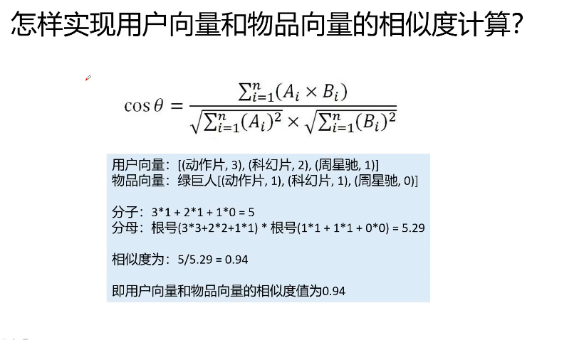

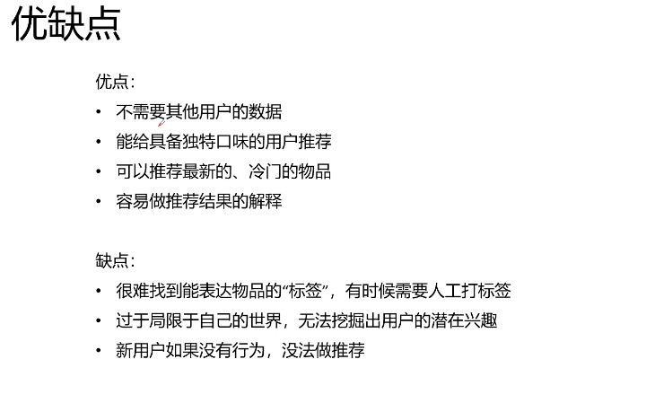

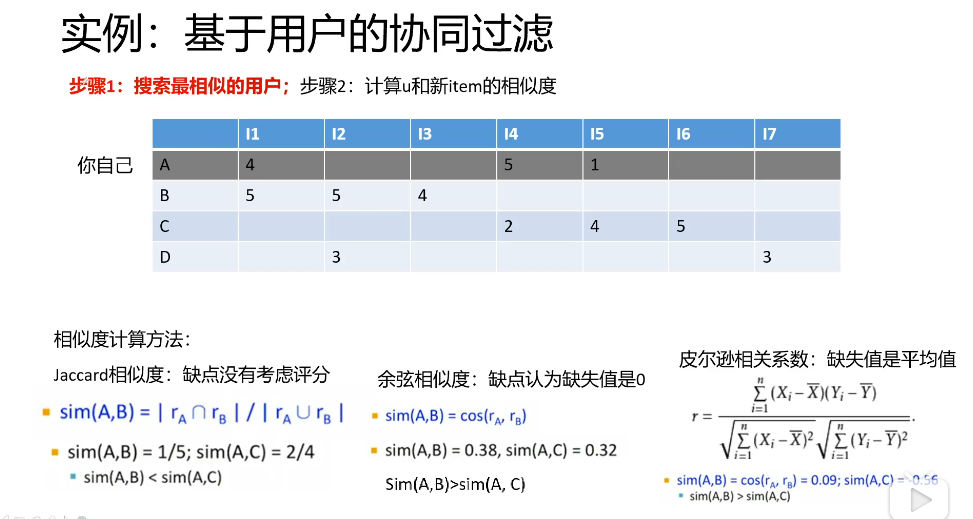

基于用户


解决冷启动


## 异地多活

如果“注册”“登录”、“用户信息”全部都要支持异地多活的话，实际上是挺难的，有的问题甚至是无解的。那这种情况下我们应该如何考虑“异地多活”的方案设计呢？答案其实很简单：**优先实现核心业务的异地多活方案**！

异地多活本质上是通过异地的数据冗余，来保证在极端异常的情况下业务也能够正常提供给用户，因此数据同步是异地多活设计方案的核心

解决

1. 尽量减少异地多活机房的距离，搭建高速网络；

2. 尽量减少数据同步；

3. 保证最终一致性，不保证实时一致性；

   【减少距离：同城多中心】\****

   为了减少两个业务中心的距离，选择在同一个城市不同的区搭建机房，机房间通过高速网络连通，例如在北京的海定区和通州区各搭建一个机房，两个机房间采用高速光纤网络连通，能够达到近似在一个机房的性能。

   这个方案的优势在于对业务几乎没有影响，业务可以无缝的切换到同城多中心方案；缺点就是无法应对例如新奥尔良全城被水淹，或者2003美加大停电这种极端情况。所以即使采用这种方案，也还必须有一个其它城市的业务中心作为备份，最终的方案同样还是要考虑远距离的数据传输问题。 

   ***\*【减少数据同步】\****

   另外一种方式就是减少需要同步的数据。简单来说就是不重要的数据不要同步，同步后没用的数据不同步。

   以前面的“用户子系统”为例，用户登录所产生的token或者session信息，数据量很大，但其实并不需要同步到其它业务中心，因为这些数据丢失后重新登录就可以了。

   有的朋友会问：这些数据丢失后要求用户重新登录，影响用户体验的呀！
   确实如此，毕竟需要用户重新输入账户和密码信息，或者至少要弹出登录界面让用户点击一次，但相比为了同步所有数据带来的代价，这个影响完全可以接受，其实这个问题也涉及了一个异地多活设计的典型思维误区，后面我们会详细讲到。 

   ***\*【保证最终一致性】\****

   第三种方式就是业务不依赖数据同步的实时性，只要数据最终能一致即可。例如：A机房注册了一个用户，业务上不要求能够在50ms内就同步到所有机房，正常情况下要求5分钟同步到所有机房即可，异常情况下甚至可以允许1小时或者1天后能够一致。

   ​	

   不只使用存储系统的同步功能

    以MySQL为例，MySQL5.1版本的复制是单线程的复制，在网络抖动或者大量数据同步的时候，经常发生延迟较长的问题，短则延迟十几秒，长则可能达到十几分钟。而且即使我们通过监控的手段知道了MySQL同步时延较长，也难以采取什么措施，只能干等。

    Redis又是另外一个问题，Redis 3.0之前没有Cluster功能，只有主从复制功能，而为了设计上的简单，Redis主从复制有一个比较大的隐患：从机宕机或者和主机断开连接都需要重新连接主机，重新连接主机都会触发全量的主从复制，这时候主机会生成内存快照，主机依然可以对外提供服务，但是作为读的从机，就无法提供对外服务了，如果数据量大，恢复的时间会相当的长。

   我们可以采用如下几种方式同步数据：

   1. ***\*消息队列方式\****：对于账号数据，由于账号只会创建，不会修改和删除（假设我们不提供删除功能），我们可以将账号数据通过消息队列同步到其它业务中心。
   2. ***\*二次读取方式\****：某些情况下可能出现消息队列同步也延迟了，用户在A中心注册，然后访问B中心的业务，此时B中心本地拿不到用户的账号数据。为了解决这个问题，B中心在读取本地数据失败的时候，可以根据路由规则，再去A中心访问一次（这就是所谓的二次读取，第一次读取本地，本地失败后第二次读取对端），这样就能够解决异常情况下同步延迟的问题。
   3. ***\*存储系统同步方式\****：对于密码数据，由于用户改密码频率较低，而且用户不可能在1s内连续改多次密码，所以通过数据库的同步机制将数据复制到其它业务中心即可，用户信息数据和密码类似。
   4. ***\*回源读取方式\****：对于登录的session数据，由于数据量很大，我们可以不同步数据；但当用户在A中心登录后，然后又在B中心登录，B中心拿到用户上传的session id后，根据路由判断session属于A中心，直接去A中心请求session数据即可，反之亦然，A中心也可以到B中心去拿取session数据。
   5. ***\*重新生成数据方式\****：对于第4中场景，如果异常情况下，A中心宕机了，B中心请求session数据失败，此时就只能登录失败，让用户重新在B中心登录，生成新的session数据。


# 智力题

## 详解十二小球问题：天平称三次最多可以对付几个球？


https://www.bilibili.com/video/BV19t4y1X7D3?from=search&seid=14600978108298952056

作者：大锤0123
链接：https://www.nowcoder.com/discuss/437267?type=2&order=3&pos=15&page=1&channel=666&source_id=discuss_tag
来源：牛客网

有A，B两个人，双方轮着数数。每次说出的数字，只能在对方的基础上加一或者加二，当最后谁先数到30及以上谁输。如果A先从0开始数，那你有什么方法使得A必赢？能否用具体算法实现。

答案：倒推就行了，只要谁拿到了n+1是3的倍数，就必赢。必赢序列 29， 26， 23， 20， 17 ，14 ，11， 8， 5， 2。只要任意一个人命中这个序列，按照这个顺序走就行了。按照题意，A先出0，B足够聪明的话，A必输。

## 赛马问题

https://zhuanlan.zhihu.com/p/103572219

# 情景题

## 二维码扫描登录原理

https://juejin.im/post/5e83e716e51d4546c27bb559#comment

## 设计一个第三方账号登陆

https://juejin.im/post/5dbd9c5af265da4d3a52e4a2#comment


