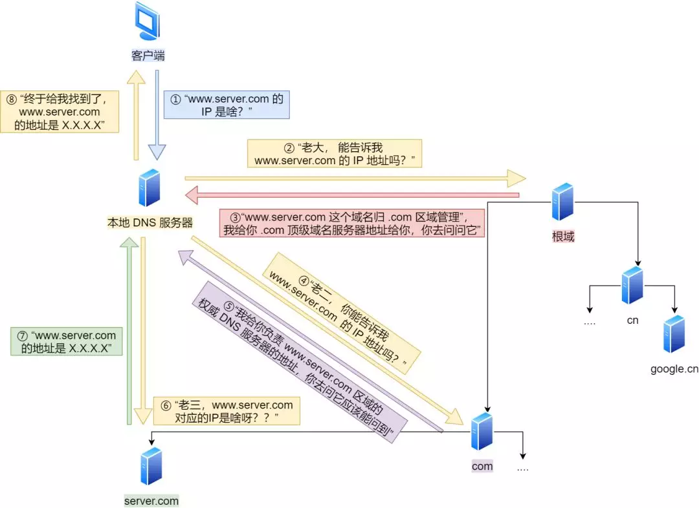
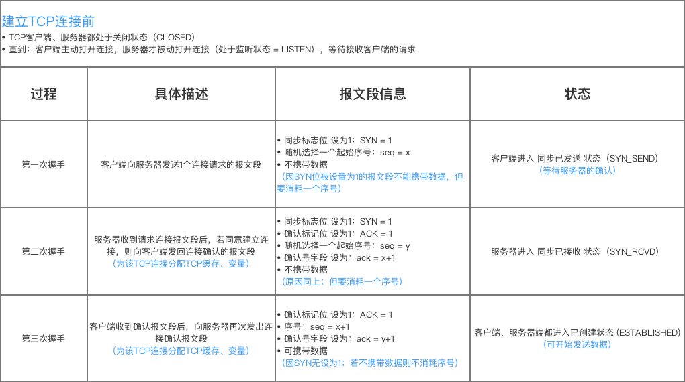
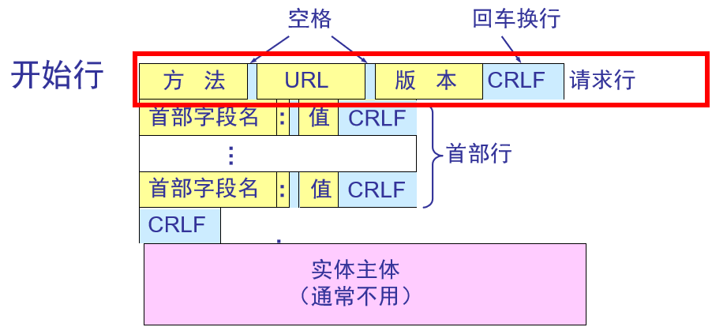

# 计算机网络


## 输入网址后发生了什么

https://mp.weixin.qq.com/s/I6BLwbIpfGEJnxjDcPXc1A

1.浏览器做的第一步工作是解析 URL

对 `URL` 进行解析之后，浏览器确定了 Web 服务器和文件名，接下来就是根据这些信息来生成 HTTP 请求消息了。

2 真实地址查询 —— DNS 



3 协议栈

通过 DNS 获取到 IP 后，就可以把 HTTP 的传输工作交给操作系统中的**协议栈**。

04 可靠传输 —— TCP 

TCP 传输数据之前，要先三次握手建立连接

TCP 分割数据

TCP 报文生成

05  远程定位 —— IP 

TCP 模块在执行连接、收发、断开等各阶段操作时，都需要委托 IP 模块将数据封装成网络包发送给通信对象。

06 两点传输 —— MAC 

用于两点之间的传输

07 出口 —— 网卡 

08 送别者 —— 交换机 

交换机的设计是将网络包原样转发到目的地。交换机工作在 MAC 层，也称为二层网络设备。


## TCP粘包

https://juejin.im/post/5b67902f6fb9a04fc67c1a24#comment

TCP 是一个面向字节流的协议，它是性质是流式的，所以它并没有分段。就像水流一样，你没法知道什么时候开始，什么时候结束。


解决：

- 在报文末尾增加换行符表明一条完整的消息，这样在接收端可以根据这个换行符来判断消息是否完整。
- 将消息分为消息头、消息体。可以在消息头中声明消息的长度，根据这个长度来获取报文（比如 808 协议）。
- 规定好报文长度，不足的空位补齐，取的时候按照长度截取即可。

## UDP实现可靠

https://zhuanlan.zhihu.com/p/30770889


**CP属于是通过增大延迟和传输成本来保证质量的通信方式，UDP是通过牺牲质量来保证时延和成本的通信方式，所以在一些特定场景下RUDP更容易找到这样的平衡点。**RUDP是怎么去找这个平衡点的

可靠的概念

在实时通信过程中，不同的需求场景对可靠的需求是不一样的，我们在这里总体归纳为三类定义：

l **尽力可靠**：通信的接收方要求发送方的数据**尽量完整**到达，但业务本身的数据是可以允许缺失的。例如：音视频数据、幂等性状态数据。

l **无序可靠**：通信的接收方要求发送方的数据**必须完整到达，但可以不管到达先后顺序**。例如：文件传输、白板书写、图形实时绘制数据、日志型追加数据等。

l **有序可靠**：通信接收方要求发送方的数据必须**按顺序完整到达**。

RUDP是根据这三类需求和图1的三角制约关系来确定自己的通信模型和机制的，也就是找通信的平衡点。 

UDP为什么要可靠

TCP是个基于公平性的可靠通信协议，在一些苛刻的网络条件下TCP要么不能提供正常的通信质量保证，要么成本过高。为什么要在UDP之上做可靠保证，究其原因就是在保证通信的时延和质量的条件下尽量降低成本

实现：

重传模式 窗口与拥塞控制

## TCP

https://www.jianshu.com/p/65605622234b





### 为什么客户端关闭连接前要等待2MSL时间？

原因1：为了保证客户端发送的最后1个连接释放确认报文 能到达服务器，从而使得服务器能正常释放连接

原因2：防止 上文提到的早已失效的连接请求报文 出现在本连接中
 客户端发送了最后1个连接释放请求确认报文后，再经过2`MSL`时间，则可使本连接持续时间内所产生的所有报文段都从网络中消失。

即 在下1个新的连接中就不会出现早已失效的连接请求报文

### 拥塞控制


TCP和UDP区别


## HTTP格式

请求



响应


## HTTP 与 HTTPS 的区别

https://juejin.im/entry/58d7635e5c497d0057fae036

 1、https协议需要到ca申请证书，一般免费证书较少，因而需要一定费用。

 2、http是超文本传输协议，信息是明文传输，https则是具有安全性的ssl加密传输协议。

 3、http和https使用的是完全不同的连接方式，用的端口也不一样，前者是80，后者是443。

 4、http的连接很简单，是无状态的；HTTPS协议是由SSL+HTTP协议构建的可进行加密传输、身份认证的网络协议，比http协议安全。


# Redis

## 主从复制实现

1.设置主服务器的地址和端口

2.建立套接字连接

3.发送Ping命令

4.身份验证

5.从服务器向主服务器发送端口信息，主服务器保存在自己的状态中

6.同步     第一次的话是全量同步，之后可以进行部分同步

全量同步  发送  PSYNC ? -1 

部分重同步    PSYNC<runid> <offset>  如果offset在主服务器的复制积压缓冲区中，就不能发起全量同步

7.命令传播

从服务器一直接受主服务器发来的写命令就行了


## 故障转移

1.选出新的主服务器 

有优先级的，如偏移量

领头哨兵对选择的主节点发送成为主节点的命令，当这个主节点返回的心跳信息包含自己是主节点的信息，证明选举成功

2.修改从服务器的复制目标

领头哨兵向其他从服务器发送命令

3.将旧的主服务器变为从服务器

## Redis为什么是单线程

CPU不是Redis的瓶颈。Redis的瓶颈最有可能是机器内存或者网络带宽，既然单线程容易实现，而且CPU不会成为瓶颈，那就顺理成章地采用单线程的方案了

## Redis为什么这么快

1、完全基于内存，绝大部分请求是纯粹的内存操作，非常快速。数据存在内存中，类似于HashMap，HashMap的优势就是查找和操作的时间复杂度都是O(1)；

2、数据结构简单，对数据操作也简单，Redis中的数据结构是专门进行设计的；

比如Redis 使用SDS而不是C字符串  这样可以减少修改字符串长度时所需的内存重新分配的次数

3、采用单线程，避免了不必要的上下文切换和竞争条件，也不存在多进程或者多线程导致的切换而消耗 CPU，不用去考虑各种锁的问题，不存在加锁释放锁操作，没有因为可能出现死锁而导致的性能消耗；

4、使用多路I/O复用模型，非阻塞IO；

5、使用底层模型不同，它们之间底层实现方式以及与客户端之间通信的应用协议不一样，Redis直接自己构建了VM 机制 ，因为一般的系统调用系统函数的话，会浪费一定的时间去移动和请求；


# MyBatis

## 一二级缓存

https://www.jianshu.com/p/16ff1fc9e13c

https://www.jianshu.com/p/16ff1fc9e13c

一级


二级


# 数据结构

## 排序

https://juejin.im/post/5b95da8a5188255c775d8124#comment


### 冒泡排序

```
package com.fufu.algorithm.sort;

import java.util.Arrays;

/**
 * 冒泡排序
 * Created by zhoujunfu on 2018/8/2.
 */
public class BubbleSort {
    public static void sort(int[] array) {
        if (array == null || array.length == 0) {
            return;
        }

        int length = array.length;
        //外层：需要length-1次循环比较
        for (int i = 0; i < length - 1; i++) {
            //内层：每次循环需要两两比较的次数，每次比较后，都会将当前最大的数放到最后位置，所以每次比较次数递减一次
            for (int j = 0; j < length - 1 - i; j++) {
                if (array[j] > array[j+1]) {
                    //交换数组array的j和j+1位置的数据
                    swap(array, j, j+1);
                }
            }
        }
    }

    /**
     * 交换数组array的i和j位置的数据
     * @param array 数组
     * @param i 下标i
     * @param j 下标j
     */
    public static void swap(int[] array, int i, int j) {
        int temp = array[i];
        array[i] = array[j];
        array[j] = temp;
    }
}


```

### 快速排序

```
/**
 * 快速排序
 * Created by zhoujunfu on 2018/8/6.
 */
public class QuickSort {
    /**
     * 快速排序（左右指针法）
     * @param arr 待排序数组
     * @param low 左边界
     * @param high 右边界
     */
    public static void sort2(int arr[], int low, int high) {
        if (arr == null || arr.length <= 0) {
            return;
        }
        if (low >= high) {
            return;
        }

        int left = low;
        int right = high;

        int key = arr[left];

        while (left < right) {
            while (left < right && arr[right] >= key) {
                right--;
            }
            while (left < right && arr[left] <= key) {
                left++;
            }
            if (left < right) {
                swap(arr, left, right);
            }
        }
        swap(arr, low, left);
        System.out.println("Sorting: " + Arrays.toString(arr));
        sort2(arr, low, left - 1);
        sort2(arr, left + 1, high);
    }

    public static void swap(int arr[], int low, int high) {
        int tmp = arr[low];
        arr[low] = arr[high];
        arr[high] = tmp;
    }
}

```

### 直接插入排序

```
public static void sort(int[] a) {
        if (a == null || a.length == 0) {
            return;
        }

        for (int i = 1; i < a.length; i++) {
            int j = i - 1;
            int temp = a[i]; // 先取出待插入数据保存，因为向后移位过程中会把覆盖掉待插入数
            while (j >= 0 && a[j] > temp) { // 如果待是比待插入数据大，就后移
                a[j+1] = a[j];
                j--;
            }
            a[j+1] = temp; // 找到比待插入数据小的位置，将待插入数据插入
        }
    }


```

